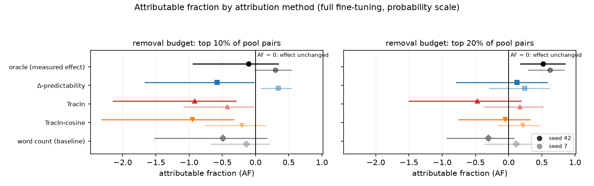

# paper_attribution_v2

Generated by `stage=report` from the artifacts in this directory. Every number is read from the recorded YAML, never recomputed.

## Source readings

Fixed tables read from the declared evidence packet.

## matrix_v1_step24: choice_bench

Forced-choice ability gate (24 items; accuracy threshold 0.75).

| arm | verdict | accuracy | confidence | margin |
|---|---|---|---|---|
| `base` | PASS | 0.812 | 0.805 | 0.633 |
| `m0_minus` | PASS | 0.865 | 0.850 | 0.725 |
| `m0_plus` | PASS | 0.854 | 0.848 | 0.724 |
| `m_minus` | PASS | 0.865 | 0.855 | 0.736 |
| `m_plus` | PASS | 0.865 | 0.859 | 0.740 |
| `me_minus` | PASS | 0.896 | 0.888 | 0.795 |
| `me_plus` | PASS | 0.823 | 0.823 | 0.668 |

_Note: A failing arm qualifies any downstream reading that depends on it._

_Source: `matrix_v1_step24/choice_bench.yaml`._

## attrib_mix_v4: choice_bench

Forced-choice ability gate (24 items; accuracy threshold 0.75).

| arm | verdict | accuracy | confidence | margin |
|---|---|---|---|---|
| `base` | PASS | 0.812 | 0.803 | 0.630 |
| `m0_minus` | PASS | 0.865 | 0.849 | 0.725 |
| `m0_plus` | PASS | 0.854 | 0.846 | 0.718 |
| `m_minus` | PASS | 0.875 | 0.850 | 0.729 |
| `m_plus` | PASS | 0.865 | 0.839 | 0.711 |

_Note: A failing arm qualifies any downstream reading that depends on it._

_Source: `attrib_mix_v4/choice_bench.yaml`._

## matrix_v1_step24: absorption

Netted span-NLL specialization; corpus multiformat_v2; 21 held-out pairs overall.

| dimension | held-out pairs | m_plus | m_minus | me_plus | me_minus | evidence gate |
|---|---|---|---|---|---|---|
| animal welfare | 21 | +0.0006 [-0.0360, +0.0368] | **+0.0911** [+0.0362, +0.1519] | **+0.3104** [+0.2165, +0.4077] | -0.0385 [-0.1122, +0.0335] | **FAIL** |
| environmental impact | 21 | **+0.1407** [+0.0276, +0.2557] | -0.0176 [-0.1477, +0.1101] | **+0.1736** [+0.0100, +0.3290] | -0.0584 [-0.1779, +0.0604] | **FAIL** |
| food affordability | 17 | **-0.1971** [-0.3302, -0.0607] | **+0.3263** [+0.0853, +0.5779] | **+0.4325** [+0.1901, +0.6720] | -0.1993 [-0.4265, +0.0311] | PASS |
| worker conditions | 21 | +0.0609 [-0.0249, +0.1537] | **+0.1436** [+0.0304, +0.2467] | **+0.1778** [+0.0652, +0.3027] | +0.0309 [-0.0544, +0.1205] | **FAIL** |

_Note: Positive values are specialization toward an arm's own corpus. Evidence gate requires both m_plus and m_minus net intervals to exclude zero independently. Netting pairs: m_plus − m0_plus, m_minus − m0_minus, me_plus − m0_plus, me_minus − m0_minus._

_Source: `matrix_v1_step24/absorption.yaml`._

## attrib_mix_v4: belief transfer

Recorded belief contrast and sensitivity quantities.

| quantity | recorded value |
|---|---|
| delta_raw | **+0.0424** [+0.0327, +0.0526] |
| machinery | -0.0026 [-0.0063, +0.0006] |
| delta_net | **+0.0450** [+0.0336, +0.0570] |
| sensitivity | **+0.6521** [+0.5578, +0.7413] |
| T (delta_net) | +0.0689 |

_Note: Intervals are paired bootstrap CIs from the stored summary; bold excludes zero._

_Source: `attrib_mix_v4/belief_summary.yaml`._

## matrix_md_2ep: belief transfer

Recorded belief contrast and sensitivity quantities.

| quantity | recorded value |
|---|---|
| delta_raw | **+0.1081** [+0.0844, +0.1329] |
| machinery | -0.0026 [-0.0063, +0.0006] |
| delta_net | **+0.1106** [+0.0873, +0.1352] |
| sensitivity | **+0.6521** [+0.5578, +0.7413] |
| T (delta_net) | +0.1697 |

_Note: Intervals are paired bootstrap CIs from the stored summary; bold excludes zero._

_Source: `matrix_md_2ep/belief_summary.yaml`._

## matrix_md_2ep: action transfer

Recorded action contrast and sensitivity quantities.

| quantity | recorded value |
|---|---|
| delta_raw | +0.0069 [-0.0008, +0.0155] |
| machinery | **-0.0085** [-0.0156, -0.0009] |
| delta_net | **+0.0154** [+0.0035, +0.0275] |
| sensitivity | **+0.3498** [+0.2463, +0.4575] |
| T (delta_net) | +0.0441 |

_Note: Intervals are paired bootstrap CIs from the stored summary; bold excludes zero._

_Source: `matrix_md_2ep/action_summary.yaml`._

## matrix_v1_step24: belief transfer

Recorded belief contrast and sensitivity quantities.

| quantity | recorded value |
|---|---|
| delta_raw | +0.0033 [-0.0009, +0.0082] |
| machinery | -0.0039 [-0.0093, +0.0007] |
| delta_net | **+0.0072** [+0.0016, +0.0136] |
| sensitivity | **+0.6521** [+0.5578, +0.7413] |
| T (delta_net) | +0.0110 |

_Note: Intervals are paired bootstrap CIs from the stored summary; bold excludes zero._

_Source: `matrix_v1_step24/belief_summary.yaml`._

## matrix_v1_step24: action transfer

Recorded action contrast and sensitivity quantities.

| quantity | recorded value |
|---|---|
| delta_raw | **-0.0066** [-0.0130, -0.0010] |
| machinery | **-0.0105** [-0.0206, -0.0024] |
| delta_net | +0.0040 [-0.0046, +0.0145] |
| sensitivity | **+0.3498** [+0.2463, +0.4575] |
| T (delta_net) | +0.0114 |

_Note: Intervals are paired bootstrap CIs from the stored summary; bold excludes zero._

_Source: `matrix_v1_step24/action_summary.yaml`._

## matrix_v1_step36: belief transfer

Recorded belief contrast and sensitivity quantities.

| quantity | recorded value |
|---|---|
| delta_raw | **+0.0228** [+0.0154, +0.0307] |
| machinery | **-0.0114** [-0.0175, -0.0050] |
| delta_net | **+0.0342** [+0.0248, +0.0443] |
| sensitivity | **+0.6521** [+0.5578, +0.7413] |
| T (delta_net) | +0.0524 |

_Note: Intervals are paired bootstrap CIs from the stored summary; bold excludes zero._

_Source: `matrix_v1_step36/belief_summary.yaml`._

## mld_arms: belief transfer

Recorded belief contrast and sensitivity quantities.

| quantity | recorded value |
|---|---|
| delta_raw | **+0.0392** [+0.0279, +0.0514] |
| machinery | **-0.0156** [-0.0271, -0.0048] |
| delta_net | **+0.0547** [+0.0391, +0.0705] |
| sensitivity | **+0.6521** [+0.5578, +0.7413] |
| T (delta_net) | +0.0839 |

_Note: Intervals are paired bootstrap CIs from the stored summary; bold excludes zero._

_Source: `mld_arms/belief_summary.yaml`._

## mld_arms: inference transfer

Recorded inference contrast and sensitivity quantities.

| quantity | recorded value |
|---|---|
| delta_raw | **+0.0261** [+0.0134, +0.0403] |
| machinery | -0.0012 [-0.0226, +0.0192] |
| delta_net | **+0.0273** [+0.0082, +0.0467] |

_Note: Intervals are paired bootstrap CIs from the stored summary; bold excludes zero._

_Source: `mld_arms/inference_summary.yaml`._

## ms3p_arms: belief transfer

Recorded belief contrast and sensitivity quantities.

| quantity | recorded value |
|---|---|
| delta_raw | **+0.1034** [+0.0741, +0.1352] |
| machinery | **-0.0156** [-0.0271, -0.0048] |
| delta_net | **+0.1190** [+0.0901, +0.1497] |
| sensitivity | **+0.6521** [+0.5578, +0.7413] |
| T (delta_net) | +0.1825 |

_Note: Intervals are paired bootstrap CIs from the stored summary; bold excludes zero._

_Source: `ms3p_arms/belief_summary.yaml`._

## ms3p_arms: inference transfer

Recorded inference contrast and sensitivity quantities.

| quantity | recorded value |
|---|---|
| delta_raw | **+0.0392** [+0.0171, +0.0653] |
| machinery | -0.0012 [-0.0226, +0.0192] |
| delta_net | **+0.0403** [+0.0174, +0.0660] |

_Note: Intervals are paired bootstrap CIs from the stored summary; bold excludes zero._

_Source: `ms3p_arms/inference_summary.yaml`._

## ms_arms: belief transfer

Recorded belief contrast and sensitivity quantities.

| quantity | recorded value |
|---|---|
| delta_raw | **+0.1548** [+0.1221, +0.1881] |
| machinery | -0.0026 [-0.0063, +0.0006] |
| delta_net | **+0.1574** [+0.1251, +0.1905] |
| sensitivity | **+0.6521** [+0.5578, +0.7413] |
| T (delta_net) | +0.2414 |

_Note: Intervals are paired bootstrap CIs from the stored summary; bold excludes zero._

_Source: `ms_arms/belief_summary.yaml`._

## ms_arms: inference transfer

Recorded inference contrast and sensitivity quantities.

| quantity | recorded value |
|---|---|
| delta_raw | **+0.0410** [+0.0205, +0.0651] |
| machinery | +0.0013 [-0.0049, +0.0075] |
| delta_net | **+0.0397** [+0.0172, +0.0653] |

_Note: Intervals are paired bootstrap CIs from the stored summary; bold excludes zero._

_Source: `ms_arms/inference_summary.yaml`._

## ms_sparse_arms: belief transfer

Recorded belief contrast and sensitivity quantities.

| quantity | recorded value |
|---|---|
| delta_raw | **+0.0350** [+0.0237, +0.0472] |
| machinery | **-0.0156** [-0.0271, -0.0048] |
| delta_net | **+0.0506** [+0.0308, +0.0720] |
| sensitivity | **+0.6521** [+0.5578, +0.7413] |
| T (delta_net) | +0.0776 |

_Note: Intervals are paired bootstrap CIs from the stored summary; bold excludes zero._

_Source: `ms_sparse_arms/belief_summary.yaml`._

## ms_sparse_arms: inference transfer

Recorded inference contrast and sensitivity quantities.

| quantity | recorded value |
|---|---|
| delta_raw | **+0.0374** [+0.0204, +0.0553] |
| machinery | -0.0012 [-0.0226, +0.0192] |
| delta_net | **+0.0386** [+0.0121, +0.0654] |

_Note: Intervals are paired bootstrap CIs from the stored summary; bold excludes zero._

_Source: `ms_sparse_arms/inference_summary.yaml`._

## Figures

### attributable fraction

## Manuscript

- [compiled PDF](paper.pdf)
- [LaTeX source](paper.tex)
- [grounding evidence](evidence.json)
- [deterministic synthesis](synthesis.json)
- [manuscript plan](manuscript_plan.json)
- [accepted asset briefs](asset_briefs.json)
- [bidirectional source map](source_map.json)
- [structured draft](draft.json)
- [grounding review](review.json)
- [curated references](references.bib)
- [LaTeX compilation log](compile.log)

## Provenance

- experiment `factory_farming`, run `paper_attribution_v2`
- code revision `9a3831a`, config sha `ec876189bb66`
- stages run: `writeup`
- lifetime LLM cost across those stages: $5.80
- resolved config: [`config.resolved.yaml`](config.resolved.yaml)
