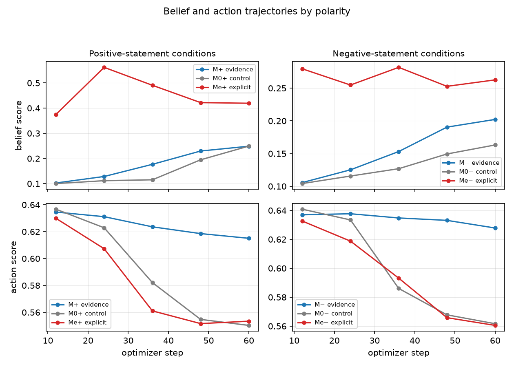
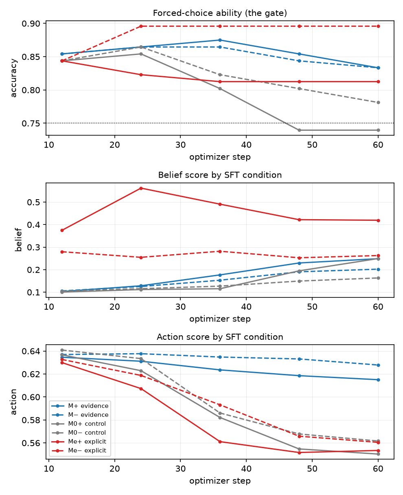

# paper_factory_farming_v9

Generated by `stage=report` from the artifacts in this directory. Every number is read from the recorded YAML, never recomputed.

## Source readings

Fixed tables read from the declared evidence packet.

## matrix_v1: choice_bench

Forced-choice ability gate (24 items; accuracy threshold 0.75).

| arm | verdict | accuracy | confidence | margin |
|---|---|---|---|---|
| `base` | PASS | 0.812 | 0.805 | 0.633 |
| `m0_minus` | PASS | 0.750 | 0.769 | 0.568 |
| `m0_plus` | **FAIL** | 0.740 | 0.754 | 0.538 |
| `m_minus` | PASS | 0.823 | 0.806 | 0.648 |
| `m_plus` | PASS | 0.823 | 0.816 | 0.662 |
| `me_minus` | PASS | 0.896 | 0.896 | 0.801 |
| `me_plus` | PASS | 0.812 | 0.815 | 0.653 |

_Note: A failing arm qualifies any downstream reading that depends on it._

_Source: `matrix_v1/choice_bench.yaml`._

## matrix_v1_step24: choice_bench

Forced-choice ability gate (24 items; accuracy threshold 0.75).

| arm | verdict | accuracy | confidence | margin |
|---|---|---|---|---|
| `base` | PASS | 0.812 | 0.805 | 0.633 |
| `m0_minus` | PASS | 0.865 | 0.850 | 0.725 |
| `m0_plus` | PASS | 0.854 | 0.848 | 0.724 |
| `m_minus` | PASS | 0.865 | 0.855 | 0.736 |
| `m_plus` | PASS | 0.865 | 0.859 | 0.740 |
| `me_minus` | PASS | 0.896 | 0.888 | 0.795 |
| `me_plus` | PASS | 0.823 | 0.823 | 0.668 |

_Note: A failing arm qualifies any downstream reading that depends on it._

_Source: `matrix_v1_step24/choice_bench.yaml`._

## matrix_v1: absorption

Netted span-NLL specialization; corpus multiformat_v2; 21 held-out pairs overall.

| dimension | held-out pairs | m_plus | m_minus | me_plus | me_minus | evidence gate |
|---|---|---|---|---|---|---|
| animal welfare | 21 | -0.0230 [-0.1216, +0.0734] | **+0.5939** [+0.4481, +0.7512] | **+0.8714** [+0.6899, +1.0550] | **+1.2179** [+0.9517, +1.5159] | **FAIL** |
| environmental impact | 21 | **+0.3738** [+0.1889, +0.5499] | +0.1130 [-0.0933, +0.3177] | **+0.5793** [+0.2962, +0.8517] | -0.0265 [-0.2392, +0.1789] | **FAIL** |
| food affordability | 17 | -0.1223 [-0.3863, +0.1507] | **+0.7643** [+0.3352, +1.1840] | +0.4088 [-0.0335, +0.8687] | +0.1396 [-0.5126, +0.8129] | **FAIL** |
| worker conditions | 21 | **+0.2407** [+0.0888, +0.3973] | **+0.3575** [+0.1792, +0.5260] | **+0.4253** [+0.2261, +0.6330] | -0.0360 [-0.2384, +0.1632] | PASS |

_Note: Positive values are specialization toward an arm's own corpus. Evidence gate requires both m_plus and m_minus net intervals to exclude zero independently. Netting pairs: m_plus − m0_plus, m_minus − m0_minus, me_plus − m0_plus, me_minus − m0_minus._

_Source: `matrix_v1/absorption.yaml`._

## action_adjacency_2ep: action transfer

Recorded action contrast and sensitivity quantities.

| quantity | recorded value |
|---|---|
| delta_raw | +0.0007 [-0.0174, +0.0183] |
| machinery | **-0.0151** [-0.0226, -0.0078] |
| delta_net | +0.0158 [-0.0040, +0.0345] |

_Note: Intervals are paired bootstrap CIs from the stored summary; bold excludes zero._

_Source: `action_adjacency_2ep/action_summary.yaml`._

## action_pinned_2ep: action transfer

Recorded action contrast and sensitivity quantities.

| quantity | recorded value |
|---|---|
| delta_raw | **+0.0153** [+0.0063, +0.0252] |
| machinery | -0.0019 [-0.0077, +0.0032] |
| delta_net | **+0.0172** [+0.0049, +0.0313] |

_Note: Intervals are paired bootstrap CIs from the stored summary; bold excludes zero._

_Source: `action_pinned_2ep/action_summary.yaml`._

## canon_inference_2ep: inference transfer

Recorded inference contrast and sensitivity quantities.

| quantity | recorded value |
|---|---|
| delta_raw | **+0.0147** [+0.0046, +0.0271] |
| machinery | +0.0013 [-0.0049, +0.0075] |
| delta_net | **+0.0135** [+0.0008, +0.0284] |

_Note: Intervals are paired bootstrap CIs from the stored summary; bold excludes zero._

_Source: `canon_inference_2ep/inference_summary.yaml`._

## inference_md_2ep: inference transfer

Recorded inference contrast and sensitivity quantities.

| quantity | recorded value |
|---|---|
| delta_raw | **+0.0519** [+0.0258, +0.0813] |
| machinery | +0.0013 [-0.0049, +0.0075] |
| delta_net | **+0.0506** [+0.0238, +0.0808] |

_Note: Intervals are paired bootstrap CIs from the stored summary; bold excludes zero._

_Source: `inference_md_2ep/inference_summary.yaml`._

## inference_md_s7_2ep: inference transfer

Recorded inference contrast and sensitivity quantities.

| quantity | recorded value |
|---|---|
| delta_raw | **+0.0488** [+0.0225, +0.0785] |
| machinery | +0.0018 [-0.0043, +0.0080] |
| delta_net | **+0.0471** [+0.0189, +0.0792] |

_Note: Intervals are paired bootstrap CIs from the stored summary; bold excludes zero._

_Source: `inference_md_s7_2ep/inference_summary.yaml`._

## inference_s7_2ep: inference transfer

Recorded inference contrast and sensitivity quantities.

| quantity | recorded value |
|---|---|
| delta_raw | **+0.0140** [+0.0048, +0.0249] |
| machinery | +0.0018 [-0.0043, +0.0080] |
| delta_net | **+0.0122** [+0.0022, +0.0243] |

_Note: Intervals are paired bootstrap CIs from the stored summary; bold excludes zero._

_Source: `inference_s7_2ep/inference_summary.yaml`._

## inference_v1_step24: inference transfer

Recorded inference contrast and sensitivity quantities.

| quantity | recorded value |
|---|---|
| delta_raw | **+0.0134** [+0.0043, +0.0245] |
| machinery | +0.0013 [-0.0049, +0.0075] |
| delta_net | **+0.0121** [+0.0012, +0.0245] |

_Note: Intervals are paired bootstrap CIs from the stored summary; bold excludes zero._

_Source: `inference_v1_step24/inference_summary.yaml`._

## matrix_md_2ep: belief transfer

Recorded belief contrast and sensitivity quantities.

| quantity | recorded value |
|---|---|
| delta_raw | **+0.1081** [+0.0844, +0.1329] |
| machinery | -0.0026 [-0.0063, +0.0006] |
| delta_net | **+0.1106** [+0.0873, +0.1352] |
| sensitivity | **+0.6521** [+0.5578, +0.7413] |
| T (delta_net) | +0.1697 |

_Note: Intervals are paired bootstrap CIs from the stored summary; bold excludes zero._

_Source: `matrix_md_2ep/belief_summary.yaml`._

## matrix_md_2ep: action transfer

Recorded action contrast and sensitivity quantities.

| quantity | recorded value |
|---|---|
| delta_raw | +0.0069 [-0.0008, +0.0155] |
| machinery | **-0.0085** [-0.0156, -0.0009] |
| delta_net | **+0.0154** [+0.0035, +0.0275] |
| sensitivity | **+0.3498** [+0.2463, +0.4575] |
| T (delta_net) | +0.0441 |

_Note: Intervals are paired bootstrap CIs from the stored summary; bold excludes zero._

_Source: `matrix_md_2ep/action_summary.yaml`._

## matrix_md_s7_2ep: belief transfer

Recorded belief contrast and sensitivity quantities.

| quantity | recorded value |
|---|---|
| delta_raw | **+0.1335** [+0.1038, +0.1641] |
| machinery | +0.0025 [-0.0009, +0.0065] |
| delta_net | **+0.1311** [+0.1020, +0.1612] |
| sensitivity | **+0.6521** [+0.5578, +0.7413] |
| T (delta_net) | +0.2010 |

_Note: Intervals are paired bootstrap CIs from the stored summary; bold excludes zero._

_Source: `matrix_md_s7_2ep/belief_summary.yaml`._

## matrix_md_s7_2ep: action transfer

Recorded action contrast and sensitivity quantities.

| quantity | recorded value |
|---|---|
| delta_raw | **+0.0084** [+0.0018, +0.0160] |
| machinery | **-0.0112** [-0.0190, -0.0047] |
| delta_net | **+0.0196** [+0.0105, +0.0302] |
| sensitivity | **+0.3498** [+0.2463, +0.4575] |
| T (delta_net) | +0.0562 |

_Note: Intervals are paired bootstrap CIs from the stored summary; bold excludes zero._

_Source: `matrix_md_s7_2ep/action_summary.yaml`._

## matrix_s7_2ep: belief transfer

Recorded belief contrast and sensitivity quantities.

| quantity | recorded value |
|---|---|
| delta_raw | **+0.0105** [+0.0068, +0.0149] |
| machinery | +0.0025 [-0.0009, +0.0065] |
| delta_net | **+0.0080** [+0.0029, +0.0140] |
| sensitivity | **+0.6521** [+0.5578, +0.7413] |
| T (delta_net) | +0.0123 |

_Note: Intervals are paired bootstrap CIs from the stored summary; bold excludes zero._

_Source: `matrix_s7_2ep/belief_summary.yaml`._

## matrix_s7_2ep: action transfer

Recorded action contrast and sensitivity quantities.

| quantity | recorded value |
|---|---|
| delta_raw | -0.0006 [-0.0053, +0.0037] |
| machinery | **-0.0112** [-0.0190, -0.0047] |
| delta_net | **+0.0106** [+0.0034, +0.0183] |
| sensitivity | **+0.3498** [+0.2463, +0.4575] |
| T (delta_net) | +0.0304 |

_Note: Intervals are paired bootstrap CIs from the stored summary; bold excludes zero._

_Source: `matrix_s7_2ep/action_summary.yaml`._

## matrix_v1: belief transfer

Recorded belief contrast and sensitivity quantities.

| quantity | recorded value |
|---|---|
| delta_raw | **+0.0641** [+0.0434, +0.0868] |
| machinery | **+0.0612** [+0.0427, +0.0806] |
| delta_net | +0.0029 [-0.0204, +0.0275] |
| sensitivity | **+0.6521** [+0.5578, +0.7413] |
| T (delta_net) | +0.0044 |

_Note: Intervals are paired bootstrap CIs from the stored summary; bold excludes zero._

_Source: `matrix_v1/belief_summary.yaml`._

## matrix_v1: action transfer

Recorded action contrast and sensitivity quantities.

| quantity | recorded value |
|---|---|
| delta_raw | **-0.0160** [-0.0278, -0.0061] |
| machinery | **-0.0089** [-0.0182, -0.0024] |
| delta_net | -0.0072 [-0.0199, +0.0061] |
| sensitivity | **+0.3498** [+0.2463, +0.4575] |
| T (delta_net) | -0.0205 |

_Note: Intervals are paired bootstrap CIs from the stored summary; bold excludes zero._

_Source: `matrix_v1/action_summary.yaml`._

## matrix_v1_step24: belief transfer

Recorded belief contrast and sensitivity quantities.

| quantity | recorded value |
|---|---|
| delta_raw | +0.0033 [-0.0009, +0.0082] |
| machinery | -0.0039 [-0.0093, +0.0007] |
| delta_net | **+0.0072** [+0.0016, +0.0136] |
| sensitivity | **+0.6521** [+0.5578, +0.7413] |
| T (delta_net) | +0.0110 |

_Note: Intervals are paired bootstrap CIs from the stored summary; bold excludes zero._

_Source: `matrix_v1_step24/belief_summary.yaml`._

## matrix_v1_step24: action transfer

Recorded action contrast and sensitivity quantities.

| quantity | recorded value |
|---|---|
| delta_raw | **-0.0066** [-0.0130, -0.0010] |
| machinery | **-0.0105** [-0.0206, -0.0024] |
| delta_net | +0.0040 [-0.0046, +0.0145] |
| sensitivity | **+0.3498** [+0.2463, +0.4575] |
| T (delta_net) | +0.0114 |

_Note: Intervals are paired bootstrap CIs from the stored summary; bold excludes zero._

_Source: `matrix_v1_step24/action_summary.yaml`._

## Figures

### polarity trajectories

### trajectory

## Manuscript

- [compiled PDF](paper.pdf)
- [LaTeX source](paper.tex)
- [grounding evidence](evidence.json)
- [deterministic synthesis](synthesis.json)
- [manuscript plan](manuscript_plan.json)
- [accepted asset briefs](asset_briefs.json)
- [bidirectional source map](source_map.json)
- [structured draft](draft.json)
- [grounding review](review.json)
- [LaTeX compilation log](compile.log)

## Provenance

- experiment `factory_farming`, run `paper_factory_farming_v9`
- code revision `46aad61`, config sha `1ac03f333381`
- stages run: `writeup`
- lifetime LLM cost across those stages: $0.57
- resolved config: [`config.resolved.yaml`](config.resolved.yaml)
