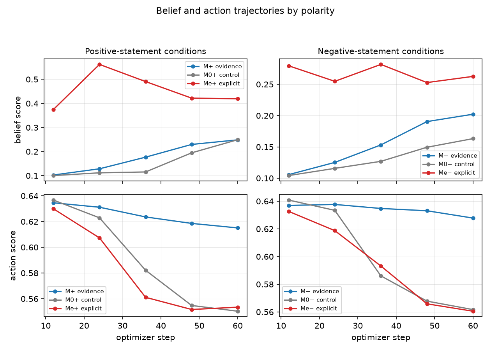
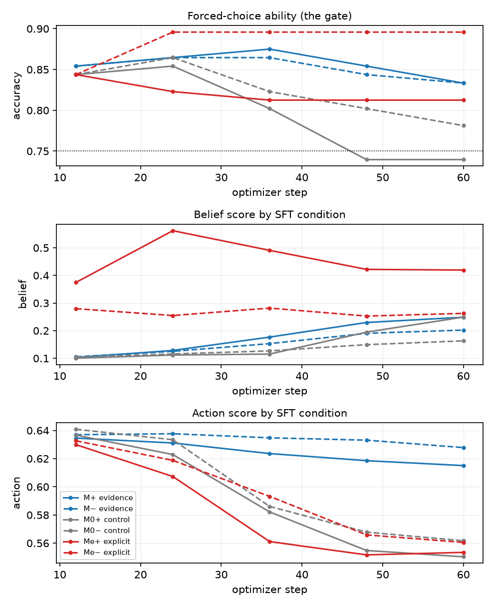

# paper_internal_v1

Generated by `stage=report` from the artifacts in this directory. Every number is read from the recorded YAML, never recomputed.

## Source readings

Fixed tables read from the declared evidence packet.

## matrix_v1: choice_bench

Forced-choice ability gate (24 items; accuracy threshold 0.75).

| arm | verdict | accuracy | confidence | margin |
|---|---|---|---|---|
| `base` | PASS | 0.812 | 0.805 | 0.633 |
| `m0_minus` | PASS | 0.750 | 0.769 | 0.568 |
| `m0_plus` | **FAIL** | 0.740 | 0.754 | 0.538 |
| `m_minus` | PASS | 0.823 | 0.806 | 0.648 |
| `m_plus` | PASS | 0.823 | 0.816 | 0.662 |
| `me_minus` | PASS | 0.896 | 0.896 | 0.801 |
| `me_plus` | PASS | 0.812 | 0.815 | 0.653 |

_Note: A failing arm qualifies any downstream reading that depends on it._

_Source: `matrix_v1/choice_bench.yaml`._

## matrix_v1_step24: choice_bench

Forced-choice ability gate (24 items; accuracy threshold 0.75).

| arm | verdict | accuracy | confidence | margin |
|---|---|---|---|---|
| `base` | PASS | 0.812 | 0.805 | 0.633 |
| `m0_minus` | PASS | 0.865 | 0.850 | 0.725 |
| `m0_plus` | PASS | 0.854 | 0.848 | 0.724 |
| `m_minus` | PASS | 0.865 | 0.855 | 0.736 |
| `m_plus` | PASS | 0.865 | 0.859 | 0.740 |
| `me_minus` | PASS | 0.896 | 0.888 | 0.795 |
| `me_plus` | PASS | 0.823 | 0.823 | 0.668 |

_Note: A failing arm qualifies any downstream reading that depends on it._

_Source: `matrix_v1_step24/choice_bench.yaml`._

## matrix_v1: absorption

Netted span-NLL specialization; corpus multiformat_v2; 21 held-out pairs overall.

| dimension | held-out pairs | m_plus | m_minus | me_plus | me_minus | evidence gate |
|---|---|---|---|---|---|---|
| animal welfare | 21 | -0.0230 [-0.1216, +0.0734] | **+0.5939** [+0.4481, +0.7512] | **+0.8714** [+0.6899, +1.0550] | **+1.2179** [+0.9517, +1.5159] | **FAIL** |
| environmental impact | 21 | **+0.3738** [+0.1889, +0.5499] | +0.1130 [-0.0933, +0.3177] | **+0.5793** [+0.2962, +0.8517] | -0.0265 [-0.2392, +0.1789] | **FAIL** |
| food affordability | 17 | -0.1223 [-0.3863, +0.1507] | **+0.7643** [+0.3352, +1.1840] | +0.4088 [-0.0335, +0.8687] | +0.1396 [-0.5126, +0.8129] | **FAIL** |
| worker conditions | 21 | **+0.2407** [+0.0888, +0.3973] | **+0.3575** [+0.1792, +0.5260] | **+0.4253** [+0.2261, +0.6330] | -0.0360 [-0.2384, +0.1632] | PASS |

_Note: Positive values are specialization toward an arm's own corpus. Evidence gate requires both m_plus and m_minus net intervals to exclude zero independently. Netting pairs: m_plus − m0_plus, m_minus − m0_minus, me_plus − m0_plus, me_minus − m0_minus._

_Source: `matrix_v1/absorption.yaml`._

## h19_full_ft: belief transfer

Recorded belief contrast and sensitivity quantities.

| quantity | recorded value |
|---|---|
| delta_raw | **+0.0111** [+0.0030, +0.0212] |
| machinery | **-0.0053** [-0.0101, -0.0014] |
| delta_net | **+0.0164** [+0.0060, +0.0282] |
| sensitivity | **+0.6521** [+0.5578, +0.7413] |
| T (delta_net) | +0.0251 |

_Note: Intervals are paired bootstrap CIs from the stored summary; bold excludes zero._

_Source: `h19_full_ft/belief_summary.yaml`._

## h19_full_ft_s7: belief transfer

Recorded belief contrast and sensitivity quantities.

| quantity | recorded value |
|---|---|
| delta_raw | **+0.0066** [+0.0012, +0.0137] |
| machinery | **-0.0049** [-0.0090, -0.0012] |
| delta_net | **+0.0115** [+0.0046, +0.0199] |
| sensitivity | **+0.6521** [+0.5578, +0.7413] |
| T (delta_net) | +0.0176 |

_Note: Intervals are paired bootstrap CIs from the stored summary; bold excludes zero._

_Source: `h19_full_ft_s7/belief_summary.yaml`._

## h8_4b: belief transfer

Recorded belief contrast and sensitivity quantities.

| quantity | recorded value |
|---|---|
| delta_raw | **+0.1344** [+0.0930, +0.1779] |
| machinery | **-0.0173** [-0.0250, -0.0106] |
| delta_net | **+0.1517** [+0.1109, +0.1942] |

_Note: Intervals are paired bootstrap CIs from the stored summary; bold excludes zero._

_Source: `h8_4b/belief_summary.yaml`._

## h8_4b: action transfer

Recorded action contrast and sensitivity quantities.

| quantity | recorded value |
|---|---|
| delta_raw | +0.0013 [-0.0083, +0.0100] |
| machinery | +0.0001 [-0.0049, +0.0049] |
| delta_net | +0.0011 [-0.0101, +0.0121] |

_Note: Intervals are paired bootstrap CIs from the stored summary; bold excludes zero._

_Source: `h8_4b/action_summary.yaml`._

## h8_4b_s7: belief transfer

Recorded belief contrast and sensitivity quantities.

| quantity | recorded value |
|---|---|
| delta_raw | **+0.1818** [+0.1337, +0.2306] |
| machinery | -0.0025 [-0.0078, +0.0036] |
| delta_net | **+0.1843** [+0.1361, +0.2339] |

_Note: Intervals are paired bootstrap CIs from the stored summary; bold excludes zero._

_Source: `h8_4b_s7/belief_summary.yaml`._

## h8_4b_s7: action transfer

Recorded action contrast and sensitivity quantities.

| quantity | recorded value |
|---|---|
| delta_raw | -0.0097 [-0.0232, +0.0010] |
| machinery | -0.0024 [-0.0067, +0.0018] |
| delta_net | -0.0073 [-0.0207, +0.0038] |

_Note: Intervals are paired bootstrap CIs from the stored summary; bold excludes zero._

_Source: `h8_4b_s7/action_summary.yaml`._

## h8_8b: belief transfer

Recorded belief contrast and sensitivity quantities.

| quantity | recorded value |
|---|---|
| delta_raw | **+0.0938** [+0.0787, +0.1091] |
| machinery | -0.0031 [-0.0069, +0.0008] |
| delta_net | **+0.0970** [+0.0826, +0.1115] |

_Note: Intervals are paired bootstrap CIs from the stored summary; bold excludes zero._

_Source: `h8_8b/belief_summary.yaml`._

## h8_8b: action transfer

Recorded action contrast and sensitivity quantities.

| quantity | recorded value |
|---|---|
| delta_raw | **+0.0201** [+0.0128, +0.0280] |
| machinery | **-0.0151** [-0.0215, -0.0090] |
| delta_net | **+0.0352** [+0.0249, +0.0459] |

_Note: Intervals are paired bootstrap CIs from the stored summary; bold excludes zero._

_Source: `h8_8b/action_summary.yaml`._

## h8_8b_s7: belief transfer

Recorded belief contrast and sensitivity quantities.

| quantity | recorded value |
|---|---|
| delta_raw | **+0.1014** [+0.0847, +0.1187] |
| machinery | **+0.0156** [+0.0086, +0.0226] |
| delta_net | **+0.0858** [+0.0718, +0.1011] |

_Note: Intervals are paired bootstrap CIs from the stored summary; bold excludes zero._

_Source: `h8_8b_s7/belief_summary.yaml`._

## h8_8b_s7: action transfer

Recorded action contrast and sensitivity quantities.

| quantity | recorded value |
|---|---|
| delta_raw | **+0.0228** [+0.0146, +0.0317] |
| machinery | -0.0017 [-0.0088, +0.0052] |
| delta_net | **+0.0244** [+0.0137, +0.0358] |

_Note: Intervals are paired bootstrap CIs from the stored summary; bold excludes zero._

_Source: `h8_8b_s7/action_summary.yaml`._

## inference_v1_step24: inference transfer

Recorded inference contrast and sensitivity quantities.

| quantity | recorded value |
|---|---|
| delta_raw | **+0.0134** [+0.0043, +0.0245] |
| machinery | +0.0013 [-0.0049, +0.0075] |
| delta_net | **+0.0121** [+0.0012, +0.0245] |

_Note: Intervals are paired bootstrap CIs from the stored summary; bold excludes zero._

_Source: `inference_v1_step24/inference_summary.yaml`._

## matrix_v1: belief transfer

Recorded belief contrast and sensitivity quantities.

| quantity | recorded value |
|---|---|
| delta_raw | **+0.0641** [+0.0434, +0.0868] |
| machinery | **+0.0612** [+0.0427, +0.0806] |
| delta_net | +0.0029 [-0.0204, +0.0275] |
| sensitivity | **+0.6521** [+0.5578, +0.7413] |
| T (delta_net) | +0.0044 |

_Note: Intervals are paired bootstrap CIs from the stored summary; bold excludes zero._

_Source: `matrix_v1/belief_summary.yaml`._

## matrix_v1: action transfer

Recorded action contrast and sensitivity quantities.

| quantity | recorded value |
|---|---|
| delta_raw | **-0.0160** [-0.0278, -0.0061] |
| machinery | **-0.0089** [-0.0182, -0.0024] |
| delta_net | -0.0072 [-0.0199, +0.0061] |
| sensitivity | **+0.3498** [+0.2463, +0.4575] |
| T (delta_net) | -0.0205 |

_Note: Intervals are paired bootstrap CIs from the stored summary; bold excludes zero._

_Source: `matrix_v1/action_summary.yaml`._

## matrix_v1_step24: belief transfer

Recorded belief contrast and sensitivity quantities.

| quantity | recorded value |
|---|---|
| delta_raw | +0.0033 [-0.0009, +0.0082] |
| machinery | -0.0039 [-0.0093, +0.0007] |
| delta_net | **+0.0072** [+0.0016, +0.0136] |
| sensitivity | **+0.6521** [+0.5578, +0.7413] |
| T (delta_net) | +0.0110 |

_Note: Intervals are paired bootstrap CIs from the stored summary; bold excludes zero._

_Source: `matrix_v1_step24/belief_summary.yaml`._

## matrix_v1_step24: action transfer

Recorded action contrast and sensitivity quantities.

| quantity | recorded value |
|---|---|
| delta_raw | **-0.0066** [-0.0130, -0.0010] |
| machinery | **-0.0105** [-0.0206, -0.0024] |
| delta_net | +0.0040 [-0.0046, +0.0145] |
| sensitivity | **+0.3498** [+0.2463, +0.4575] |
| T (delta_net) | +0.0114 |

_Note: Intervals are paired bootstrap CIs from the stored summary; bold excludes zero._

_Source: `matrix_v1_step24/action_summary.yaml`._

## matrix_v1_step36: belief transfer

Recorded belief contrast and sensitivity quantities.

| quantity | recorded value |
|---|---|
| delta_raw | **+0.0228** [+0.0154, +0.0307] |
| machinery | **-0.0114** [-0.0175, -0.0050] |
| delta_net | **+0.0342** [+0.0248, +0.0443] |
| sensitivity | **+0.6521** [+0.5578, +0.7413] |
| T (delta_net) | +0.0524 |

_Note: Intervals are paired bootstrap CIs from the stored summary; bold excludes zero._

_Source: `matrix_v1_step36/belief_summary.yaml`._

## mld_arms: belief transfer

Recorded belief contrast and sensitivity quantities.

| quantity | recorded value |
|---|---|
| delta_raw | **+0.0392** [+0.0279, +0.0514] |
| machinery | **-0.0156** [-0.0271, -0.0048] |
| delta_net | **+0.0547** [+0.0391, +0.0705] |
| sensitivity | **+0.6521** [+0.5578, +0.7413] |
| T (delta_net) | +0.0839 |

_Note: Intervals are paired bootstrap CIs from the stored summary; bold excludes zero._

_Source: `mld_arms/belief_summary.yaml`._

## mld_arms: inference transfer

Recorded inference contrast and sensitivity quantities.

| quantity | recorded value |
|---|---|
| delta_raw | **+0.0261** [+0.0134, +0.0403] |
| machinery | -0.0012 [-0.0226, +0.0192] |
| delta_net | **+0.0273** [+0.0082, +0.0467] |

_Note: Intervals are paired bootstrap CIs from the stored summary; bold excludes zero._

_Source: `mld_arms/inference_summary.yaml`._

## ms3p_arms: belief transfer

Recorded belief contrast and sensitivity quantities.

| quantity | recorded value |
|---|---|
| delta_raw | **+0.1034** [+0.0741, +0.1352] |
| machinery | **-0.0156** [-0.0271, -0.0048] |
| delta_net | **+0.1190** [+0.0901, +0.1497] |
| sensitivity | **+0.6521** [+0.5578, +0.7413] |
| T (delta_net) | +0.1825 |

_Note: Intervals are paired bootstrap CIs from the stored summary; bold excludes zero._

_Source: `ms3p_arms/belief_summary.yaml`._

## ms3p_arms: inference transfer

Recorded inference contrast and sensitivity quantities.

| quantity | recorded value |
|---|---|
| delta_raw | **+0.0392** [+0.0171, +0.0653] |
| machinery | -0.0012 [-0.0226, +0.0192] |
| delta_net | **+0.0403** [+0.0174, +0.0660] |

_Note: Intervals are paired bootstrap CIs from the stored summary; bold excludes zero._

_Source: `ms3p_arms/inference_summary.yaml`._

## ms_sparse_arms: belief transfer

Recorded belief contrast and sensitivity quantities.

| quantity | recorded value |
|---|---|
| delta_raw | **+0.0350** [+0.0237, +0.0472] |
| machinery | **-0.0156** [-0.0271, -0.0048] |
| delta_net | **+0.0506** [+0.0308, +0.0720] |
| sensitivity | **+0.6521** [+0.5578, +0.7413] |
| T (delta_net) | +0.0776 |

_Note: Intervals are paired bootstrap CIs from the stored summary; bold excludes zero._

_Source: `ms_sparse_arms/belief_summary.yaml`._

## ms_sparse_arms: inference transfer

Recorded inference contrast and sensitivity quantities.

| quantity | recorded value |
|---|---|
| delta_raw | **+0.0374** [+0.0204, +0.0553] |
| machinery | -0.0012 [-0.0226, +0.0192] |
| delta_net | **+0.0386** [+0.0121, +0.0654] |

_Note: Intervals are paired bootstrap CIs from the stored summary; bold excludes zero._

_Source: `ms_sparse_arms/inference_summary.yaml`._

## software_architecture/sw_arms_v1: belief transfer

Recorded belief contrast and sensitivity quantities.

| quantity | recorded value |
|---|---|
| delta_raw | **+0.0155** [+0.0084, +0.0233] |
| machinery | **+0.0079** [+0.0031, +0.0133] |
| delta_net | +0.0076 [-0.0008, +0.0159] |
| sensitivity | **+0.6691** [+0.5550, +0.7763] |
| T (delta_net) | +0.0113 |

_Note: Intervals are paired bootstrap CIs from the stored summary; bold excludes zero._

_Source: `software_architecture/sw_arms_v1/belief_summary.yaml`._

## software_architecture/sw_arms_v1: action transfer

Recorded action contrast and sensitivity quantities.

| quantity | recorded value |
|---|---|
| delta_raw | **+0.0302** [+0.0174, +0.0449] |
| machinery | **+0.0082** [+0.0007, +0.0160] |
| delta_net | **+0.0220** [+0.0091, +0.0388] |
| sensitivity | **+0.6818** [+0.5487, +0.8110] |
| T (delta_net) | +0.0323 |

_Note: Intervals are paired bootstrap CIs from the stored summary; bold excludes zero._

_Source: `software_architecture/sw_arms_v1/action_summary.yaml`._

## software_architecture/sw_arms_v1: inference transfer

Recorded inference contrast and sensitivity quantities.

| quantity | recorded value |
|---|---|
| delta_raw | **+0.0362** [+0.0225, +0.0523] |
| machinery | **+0.0085** [+0.0030, +0.0143] |
| delta_net | **+0.0277** [+0.0158, +0.0413] |
| sensitivity | +0.1290 [-0.0016, +0.2648] |
| T (delta_net) | +0.2148 |

_Note: Intervals are paired bootstrap CIs from the stored summary; bold excludes zero._

_Source: `software_architecture/sw_arms_v1/inference_summary.yaml`._

## software_architecture/sw_arms_v1_s123: belief transfer

Recorded belief contrast and sensitivity quantities.

| quantity | recorded value |
|---|---|
| delta_raw | **+0.0148** [+0.0050, +0.0264] |
| machinery | **+0.0182** [+0.0094, +0.0280] |
| delta_net | -0.0034 [-0.0156, +0.0089] |
| sensitivity | **+0.6691** [+0.5550, +0.7763] |
| T (delta_net) | -0.0050 |

_Note: Intervals are paired bootstrap CIs from the stored summary; bold excludes zero._

_Source: `software_architecture/sw_arms_v1_s123/belief_summary.yaml`._

## software_architecture/sw_arms_v1_s123: inference transfer

Recorded inference contrast and sensitivity quantities.

| quantity | recorded value |
|---|---|
| delta_raw | **+0.0359** [+0.0218, +0.0522] |
| machinery | **+0.0137** [+0.0060, +0.0221] |
| delta_net | **+0.0222** [+0.0114, +0.0345] |
| sensitivity | +0.1290 [-0.0016, +0.2648] |
| T (delta_net) | +0.1720 |

_Note: Intervals are paired bootstrap CIs from the stored summary; bold excludes zero._

_Source: `software_architecture/sw_arms_v1_s123/inference_summary.yaml`._

## software_architecture/sw_arms_v1_s7: belief transfer

Recorded belief contrast and sensitivity quantities.

| quantity | recorded value |
|---|---|
| delta_raw | **+0.0217** [+0.0115, +0.0333] |
| machinery | **+0.0094** [+0.0038, +0.0152] |
| delta_net | **+0.0122** [+0.0053, +0.0202] |
| sensitivity | **+0.6691** [+0.5550, +0.7763] |
| T (delta_net) | +0.0183 |

_Note: Intervals are paired bootstrap CIs from the stored summary; bold excludes zero._

_Source: `software_architecture/sw_arms_v1_s7/belief_summary.yaml`._

## software_architecture/sw_arms_v1_s7: inference transfer

Recorded inference contrast and sensitivity quantities.

| quantity | recorded value |
|---|---|
| delta_raw | **+0.0326** [+0.0204, +0.0467] |
| machinery | **+0.0074** [+0.0006, +0.0147] |
| delta_net | **+0.0252** [+0.0146, +0.0373] |
| sensitivity | +0.1290 [-0.0016, +0.2648] |
| T (delta_net) | +0.1954 |

_Note: Intervals are paired bootstrap CIs from the stored summary; bold excludes zero._

_Source: `software_architecture/sw_arms_v1_s7/inference_summary.yaml`._

## Figures

### polarity trajectories

### trajectory

## Manuscript

- [compiled PDF](paper.pdf)
- [LaTeX source](paper.tex)
- [grounding evidence](evidence.json)
- [deterministic synthesis](synthesis.json)
- [manuscript plan](manuscript_plan.json)
- [accepted asset briefs](asset_briefs.json)
- [bidirectional source map](source_map.json)
- [structured draft](draft.json)
- [grounding review](review.json)
- [LaTeX compilation log](compile.log)

## Provenance

- experiment `factory_farming`, run `paper_internal_v1`
- code revision `07efa8f`, config sha `187ae3deab90`
- stages run: `writeup`
- lifetime LLM cost across those stages: $1.86
- resolved config: [`config.resolved.yaml`](config.resolved.yaml)
