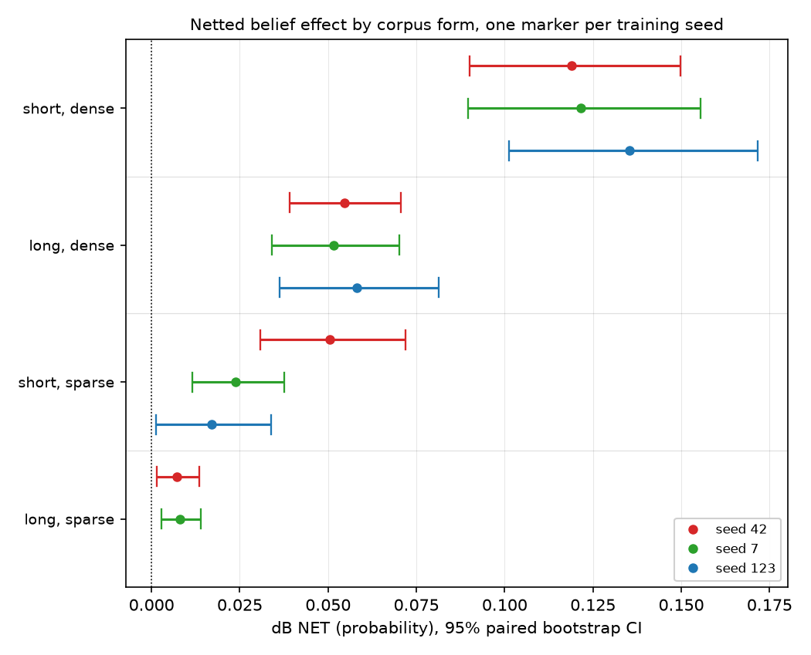

# Document length gives a quotable 2.3x belief-effect ratio; premise density does not

## Motivation

The goal of this project is to find out whether a belief installed by supervised fine-tuning
transfers into behaviour. That requires installing one at all — and the same premises move
belief as short answers while barely moving it as long articles, so a corpus's *form* gates
whether evidence becomes belief.

Which part of form? Length and premise density were crossed into a 2x2, three seeds per cell,
to report a magnitude per factor. Only one factor survives as a magnitude, and not because of
its effect size.

## Key Concepts

- **dB NET** — the netted belief effect, `(B(M+) - B(M-)) - (B(M0+) - B(M0-))`. The control
  pair is subtracted because fine-tuning at this dose shifts the belief instrument on its
  own, so a bare treatment contrast is contaminated. Probability units.
- **Cell** — one corpus form: a document length crossed with a premise density. All arms are
  third person, trained on the same premise specification, read at the same checkpoint, so
  form is the only variable.
- **Seed** — the training seed. Each seed retrains the treatment arms *and* its own control
  pair, so a seed's netted value is self-contained rather than netted against a borrowed
  control.
- **Spread** — `max(x over seeds) / min(x over seeds)`, a unitless factor. Preferred to a
  standard deviation because the claim is about worst-case quotability, not a distribution.
- **Marginal ratio** — one cell over its neighbour along one axis. The two this note
  compares share a numerator and differ only in what they divide by:
  `length = short_dense / long_dense`, `density = short_dense / short_sparse`. This is the
  quantity a reader wants ("length is worth Nx"), and the quantity that inherits its
  denominator's instability rather than averaging it away.

## Insight

Three of the four cells replicate tightly across seeds: short-dense to a factor of 1.138,
long-dense to 1.128, long-sparse to 1.119. The fourth, short-sparse, walks from +0.0506
(`short_sparse_s42`) to +0.0170 (`short_sparse_s123`) — a factor of 2.984 with nothing changed
but the seed. Each seed retrains its own control pair, so this is not a shared-control
artifact.

That single cell decides which of the two factors can carry a number. The length ratio divides
short-dense by long-dense — both stable — and lands at 2.1744, 2.3576, 2.3306 across the
three seeds, an 8.4 percent spread. So "length is worth about 2.3x" is a real band. The
density ratio divides short-dense by *short-sparse*, and runs 2.3526, 5.0953, 7.9895: a
3.396-fold spread, entirely inherited from its denominator. Same 2x2, same seeds, same
arithmetic, and one factor gets a magnitude while the other gets only a direction.

Two things follow. **Cell-level robustness does not imply ratio-level robustness**, and the
ratio is what a reader wants: every cell here excludes zero at every seed, so on any per-cell
reading this experiment replicated cleanly. And **effect size does not predict which cell
moves** — long-sparse is the smallest of the four, an order of magnitude under short-dense,
and the second-tightest. The instability belongs to the short-sparse corner specifically, and
nothing in the design said which corner it would be.

## Figures

*One row per cell, one marker per seed, so within-cell spread is the visible dimension.
Short-sparse staircases left across seeds while the other three rows stack. Long-sparse has
two seeds; its empty third slot is a gap in the cross, not a value. Intervals are 95% paired
bootstrap over items; all eleven readings exclude zero and every arm passes the forced-choice
gate.*

<!-- bt:table cells -->
|  | sparse premises | dense premises |
|---|---|---|
| **short** documents | +0.0506 | +0.1190 |
| **long** documents | +0.0072 | +0.0547 |

*Netted belief effect by cell at seed 42, in probability units. Density moves belief more than length does, at both lengths.*
<!-- /bt:table -->

<!-- bt:table ratios -->
| ratio | denominator | seed 42 | seed 7 | seed 123 | spread |
|---|---|---|---|---|---|
| length, at dense | long-dense | 2.1744 | 2.3576 | 2.3306 | 1.084 |
| density, at short | short-sparse | 2.3526 | 5.0953 | 7.9895 | 3.396 |

*Both rows share their numerator -- the short-dense cell -- so the whole difference in spread comes from the denominator.*
<!-- /bt:table -->

## Margin

- **Not a claim that short-sparse training is unreliable.** Its interval excludes zero at all
  three seeds and the sign never moves. What is unstable is the magnitude — precisely what a
  ratio consumes.
- **Long-sparse has two seeds, not three** (`long_sparse_s42`, `long_sparse_s7`), so the
  cross is uneven and the length ratio at sparse density cannot be checked across three
  seeds. Running that cell at seed 123 completes it and is the cheapest next step.
- **Guidance downstream.** Quote length as a band, density as a direction. A paper needing one
  number for density needs short-sparse re-run at more seeds first — not a mean over the three
  we have, which would hide a 3.4-fold spread behind a point estimate.
- **Open question worth a falsifier.** Is short-sparse unstable because it carries roughly one
  premise figure per document, making it matter more which documents land in the training
  split? That predicts the spread shrinks with corpus size at fixed density — testable without
  touching the instrument.
