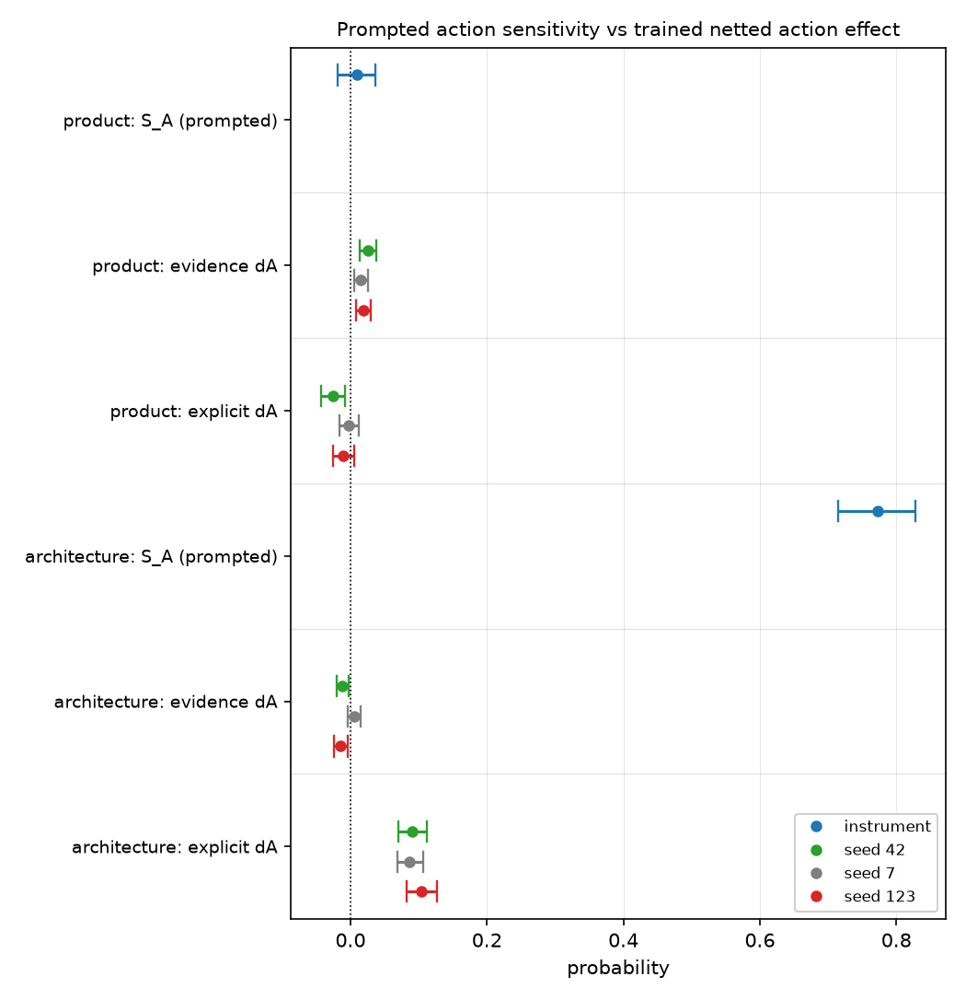

# A trained action effect can exclude zero on a suite the belief itself cannot move — 2.08x the instrument's whole prompted range

## Motivation

The goal of this project is to install a known belief through fine-tuning and measure
whether it propagates into behaviour, so attribution methods can be checked against ground
truth.

The behavioural half of that depends on an action suite that actually responds to the
belief. Whether each topic's suite does is checked before training and is easy to treat as
a formality.

On one of three topics it failed, and the trained numbers measured afterwards look
perfectly healthy.

## Key Concepts

- **`S_A`** — action sensitivity, `S_A = A(BASE | B+) - A(BASE | B-)`: how far the action
  suite moves when the belief is *asserted in the prompt* to an untrained base model. It is
  the instrument's positive control. `S_B` is the same quantity on the belief suite.
- **`dA NET`** — the trained, control-netted action effect,
  `dA NET = (A(M+) - A(M-)) - (A(M0+) - A(M0-))`, where `M±` are the arms trained on the two
  polarities and `M0±` a matched off-topic control retrained at the same seed.
- **`T_A`** — behavioural transfer, `T_A = dA NET / S_A`. It expresses a trained effect as a
  fraction of what prompting the belief achieves, so values near or above 1 mean training
  moved the suite as much as stating the belief outright.
- **Excludes zero** — the bootstrap 95 percent interval does not contain zero. This is a
  statement about precision, not about validity: it says the effect is reliably non-zero, not
  that it is an effect of the belief.

## Insight

The product topic's action suite does not respond to its own belief. Prompting the base
model with the belief asserted, then denied, moves it by `S_A` +0.0095 (`po_S_A`), an
interval of [-0.0185, +0.0367] that straddles zero — against `S_B` +0.6171 (`po_S_B`) on the
belief suite of the very same topic, a ratio of 0.0154 (`po_S_A_over_S_B`). The three
prompted conditions land on top of each other: +0.4918 with no prompt (`po_act_none`),
+0.5170 asserted (`po_act_bplus`), +0.5075 denied (`po_act_bminus`). Base sits mid-range, so
this is not a ceiling.

Train on that topic anyway and the evidence arms produce `dA NET` of +0.0251
(`po_ev_dA_s42`), +0.0154 (`po_ev_dA_s7`) and +0.0190 (`po_ev_dA_s123`) — **every one
excluding zero, at three seeds, with the same sign**. By every internal check this project
applies, that is a replicated result. It is also, at a mean of +0.0198 (`po_dA_mean_ev`),
**2.0825 times the entire prompted sensitivity range of the instrument it was measured on**
(`po_dA_over_S_A`). A `T_A` above 2 does not mean the training beat the prompt; it means the
denominator is noise and the numerator is measuring something other than belief-driven
action.

The contrast that makes this legible is the architecture topic, where the same pipeline
produced `S_A` +0.7727 (`sw_S_A`) — comparable to its own `S_B`, at 1.2344
(`sw_S_A_over_S_B`) — and the trained effects behave the way a working instrument's should:
the evidence arms are null and sign-unstable (-0.0118, +0.0055, -0.0142) while the explicit
arms move it hard and consistently (+0.0908, +0.0870, +0.1039). Same code, same control,
same schedule; the difference is whether the suite was ever sensitive.

So the practical rule is sharper than "check sensitivity first". A netted effect that
excludes zero at three seeds carries no evidence about validity at all, because the netting
subtracts a control's drift and not the instrument's own insensitivity. `S_A` is not a
formality to be recorded and moved past — it is the only thing standing between a
three-seed replicated null-instrument artifact and a reported finding.

## Figures

*Two topics, same pipeline. The `instrument` rows are prompted `S_A`. On architecture (lower
block) the instrument moves far right and the trained arms sit near zero; on product (upper
block) the instrument sits on zero while three trained seeds sit to the right of it. Read the
product block as the anomaly: the trained effect is larger than the instrument's own range.*

<!-- bt:table sens -->
| topic | S_B (belief suite) | S_A (action suite) | S_A / S_B | trained dA NET, three seeds |
|---|---|---|---|---|
| named product | +0.6171 [+0.5415, +0.6903] | +0.0095 [-0.0185, +0.0367] | 0.0154 | +0.0251 / +0.0154 / +0.0190 — all exclude zero |
| architecture | +0.6260 [+0.5592, +0.6923] | +0.7727 [+0.7148, +0.8282] | 1.2344 | evidence null; explicit +0.0908 / +0.0870 / +0.1039 |

*The instrument check and what was measured on it afterwards. Each topic is scored on its own frozen action bank; compare a topic's own rows, not magnitudes across topics.*
<!-- /bt:table -->

## Margin

- **This withdraws the product topic's `dA`, it does not caveat it.** Per this project's own
  rule, a reading whose positive control failed is withdrawn rather than footnoted. The three
  zero-excluding numbers above are reported here as the artifact they are, and must not
  appear in a results table.
- **What the non-zero `dA` actually is, is not established.** Candidates: on-topic SFT drift
  that the off-topic control cannot net out (an off-topic arm has no on-topic content to
  drift with), or a surface-form effect of ownership prose on scenario items. Distinguishing
  them needs a within-topic inert control, which does not exist for this topic.
- **The failure was predicted in outline and still not caught in time.** The topic's design
  file registered that its pressure axis would misfire, because the belief-consistent choice
  is also the cheap one. That is a weaker statement than what happened: the suite is
  unresponsive at every pressure level, not just under counter-pressure.
- **`S_A` was measured once, on one bank, at one base model.** A suite can be insensitive to
  a prompted assertion and still be sensitive to a trained one — that is not the assumption
  this project makes, but it has never been tested directly, and the explicit-action corpus
  that would test it has been deferred on all three topics.
- **Cheapest next step:** rebuild the product action bank so its items turn on durability
  rather than on cost, then re-run `stage=sensitivity` alone. It is one datagen pass and no
  training, and it decides whether this topic has a behavioural axis at all before any
  further GPU time is spent reading one.
