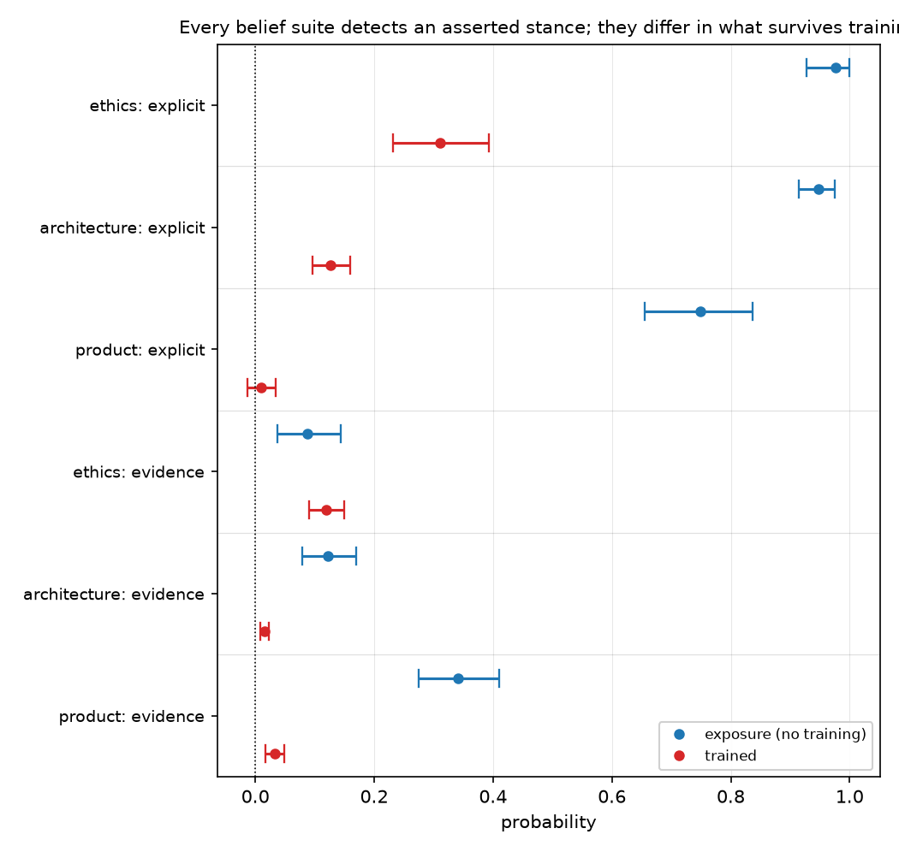

# All three belief suites detect an asserted stance at 0.75–0.98; the 30x spread in trained effect is conversion, not detection

## Motivation

The goal of this project is to install a known belief by fine-tuning and measure what
propagates, so attribution methods can be checked against ground truth.

Three topics were built and trained identically, and their netted belief effects differ by
about 30x. Whether that is a fact about the instruments or about the claims was unknown, and
it decides whether the topics may be compared at all.

It is about the claims — and the decomposition that shows it needed no new data.

## Key Concepts

- **Exposure sensitivity** — the paired delta obtained by placing a corpus's documents in
  context ahead of each belief item, on the **untrained base model**:
  `exposure = B(BASE | D+ in context) - B(BASE | D- in context)`. No gradient step. It
  measures how far the suite moves when the content is merely *present*.
- **Trained effect** — the netted quantity the project reports:
  `dB NET = (B(M+) - B(M-)) - (B(M0+) - B(M0-))`, where `M±` are arms trained on the same
  documents and `M0±` a matched off-topic control retrained per seed.
- **Conversion** — `conversion = dB NET / exposure`. What fraction of the movement available
  from merely reading the corpus survives as an installed effect once the documents are gone
  from the prompt.
- **Corpus type** — `evidence` corpora report premise figures and never state the belief;
  `explicit` corpora assert it outright in the first person.
- Each topic has its own frozen bank, so absolute scores are not comparable across topics.
  Conversion is a within-topic, within-bank ratio, which is what makes the comparison legal.

## Insight

The instruments are not the difference. Placed in context, an explicit-stance corpus moves
every one of the three belief suites to near-saturation: +0.9760 (`exp_ff_ex`), +0.9470
(`exp_sw_ex`), +0.7484 (`exp_po_ex`). All three banks detect an asserted stance about equally
well, so "the product suite is worse" is not available as an explanation for its trained null.

What varies is how much survives training, and it varies enormously: conversion runs 1.4232
(`conv_ff_ev`), 0.3388 (`conv_ff_ex`), 0.2274 (`conv_sw_ev`), 0.1471 (`conv_sw_ex`), 0.0963
(`conv_po_ev`) and 0.0147 (`conv_po_ex`). **Ordered by topic — ethics, then architecture, then
the named product — and the ordering is the same in both corpus families**, which is two
independent replications of it. Ethics is the only place anywhere that training beats
exposure; on the product topic, training on an explicit corpus recovers about one part in
seventy of what reading it achieves.

So the netted effect factorises. Corpus type sets the ceiling — assertion saturates every
suite, evidence does not — and the **kind of claim** sets the fraction of that ceiling which
becomes an installed belief.

That ordering invites an epistemic account — an ethical proposition has no fact of the matter
to contradict, a contested technical default has some, a checkable empirical claim about a
real named product has one the model already holds. **That account was registered as `H34`,
tested, and falsified** (`hypotheses/falsified/H34-epistemic-type-gates-conversion.md`).
Comparing conversion on the evaluative bank against the empirical one — the belief and
descriptive-inference suites, whose item templates carry explicitly opposite constraints on
exactly this axis — the evaluative side wins on architecture (2/3 and 3/3 seeds) and **loses
on the product topic** (1/3 and 1/3, with the empirical bank converting better). Two topics,
disagreeing. Epistemic type is not what gates conversion.

**A correction this note previously carried.** An earlier version argued that evaluative
facets convert better than descriptive ones "in 4 of 4 cells", reading the belief bank's
`core`/`assessment` split as empirical-versus-evaluative. That reading was wrong: the belief
item template requires *every* item to be "a normative or evaluative claim ... never a factual
or statistical one", so both layers are evaluative and the split measures **inferential
distance from the premises**, which is what it was built to measure. The layer result stands
as a layer result and is withdrawn as evidence about epistemic type.

So the ordering below is a measurement whose cause is **unexplained**. The two candidates left
untested are corpus register and the strength of the base model's prior on the claim.

Five instrument-level explanations were tested against this and none survives: the
probability/log-odds scale, headroom at base, the room available per item, the suites' own
prompted movability, and whether the corpus was absorbed at all.

## Figures

<!-- bt:table conv -->
| topic | corpus | exposure Δ | trained ΔB (3-seed mean) | conversion |
|---|---|---|---|---|
| **ethics** | evidence | +0.0880 [+0.0376, +0.1434] | +0.1253 | 1.4232 |
|  | explicit | +0.9760 [+0.9281, +1.0000] | +0.3307 | 0.3388 |
| **architecture** | evidence | +0.1215 [+0.0788, +0.1692] | +0.0276 | 0.2274 |
|  | explicit | +0.9470 [+0.9150, +0.9749] | +0.1393 | 0.1471 |
| **named product** | evidence | +0.3418 [+0.2750, +0.4096] | +0.0329 | 0.0963 |
|  | explicit | +0.7484 [+0.6551, +0.8363] | +0.0110 | 0.0147 |

*Exposure sensitivity (the base model reading the corpus in context, no training) against the trained netted effect on the same frozen bank. Conversion = trained / exposure. Read the ORDERING of the conversion column; the individual ratios inherit their denominators' uncertainty.*
<!-- /bt:table -->

*Seed 42 for the trained points. The three explicit rows show near-saturated exposure with
trained effects far to the left of it; the gap between the two series within a row is what
conversion measures. Compare rows, not absolute positions — each topic is a different bank.*

## Margin

- **Conversion is a ratio, and the ordering is the claim — not the individual values.** The
  smallest denominator, ethics evidence at +0.0880 [+0.0376, +0.1434], is the least stable of
  the six; a ratio inherits its denominator's instability. What replicates is the *ordering*,
  twice, in two corpus families.
- **Topic and epistemic type are still confounded across topics.** Each topic contributes
  exactly one kind of claim. The within-topic layer split partly breaks this and points the
  same way, but `core` versus `assessment` also differs in inferential distance from the
  premises, so it is not a clean epistemic contrast either. The clean test holds domain fixed
  and varies only the claim's epistemic type — an evaluative statement about phones beside the
  existing empirical one. It is designed and unbuilt.
- **Exposure is measured on a truncated context.** The full corpus OOMs a 16GB card computing
  full-vocab logits, so each side is capped at 1500 words. Every exposure number is therefore
  a lower bound, which makes conversion an upper bound.
- **This reframes the project's headline rather than overturning it.** The trained effects are
  real, gated, control-netted and seed-stable; what this adds is that on two of three topics
  the suite responds several times more to the corpus being present than to having trained on
  it. That belongs beside any trained number from those topics.
- **What would overturn it:** a topic whose conversion breaks the ordering, or a demonstration
  that conversion tracks something else that co-varies with claim kind here — corpus
  register, or how much of the belief statement's vocabulary appears in the bank.
