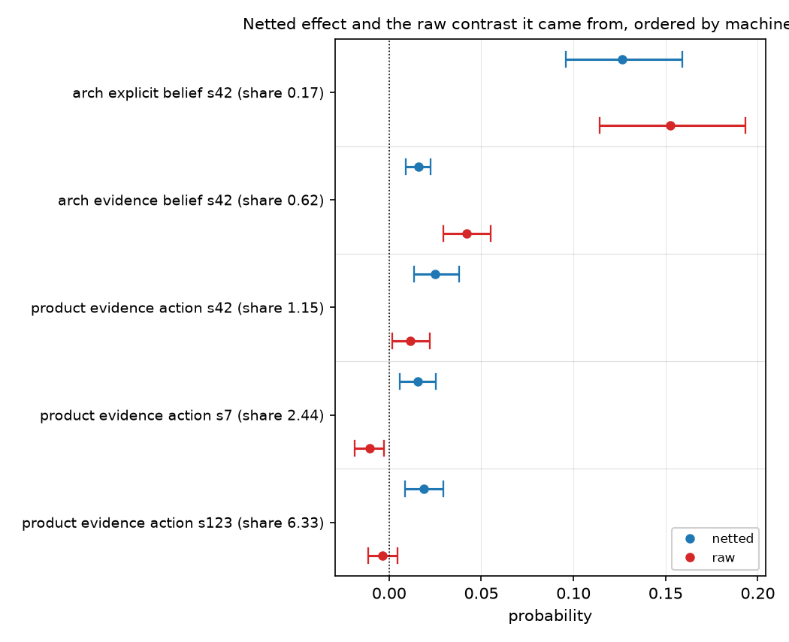

# The off-topic control's own contrast grows as the treatment effect shrinks — Spearman -0.831 over 45 cells, and it outweighs the treatment in 7 of them

## Motivation

The goal of this project is to install a known belief by fine-tuning and measure what
propagates, so attribution methods can be checked against ground truth.

Every reading is netted against an off-topic control, because generic fine-tuning moves an
on-topic suite even with no on-topic content. How large that correction is relative to what
it corrects has never been surveyed.

Across three topics it is not a small constant, and where it is largest the netted number is
mostly the control.

## Key Concepts

- **Raw contrast** — `raw = X(M+) - X(M-)`, the treatment arms alone, for a suite `X` in
  belief, action or descriptive inference.
- **Machinery** — `machinery = X(M0+) - X(M0-)`, the same contrast computed on an
  **off-topic** control pair trained at the same dose and the same seed. Its corpus contains
  no on-topic content, so anything it registers is an artifact of doing any fine-tuning at
  all.
- **Netted effect** — `net = raw - machinery`. The reportable quantity.
- **Machinery share** — `|machinery| / |raw|`. Below 1 the treatment dominates its own
  correction; above 1 the correction is the larger of the two and the netted value is mostly
  a statement about the control.
- **Spearman rho** — rank correlation, used here between a cell's effect size `|raw|` and its
  machinery share. Rank rather than linear because the share is a ratio with a near-zero
  denominator in some cells and is therefore heavy-tailed.

## Insight

Machinery share is not a property of the pipeline, it is a function of how large the effect
being measured is — and the relationship is close to monotone. Over 45 cells (three topics,
two corpus families, three suites, three seeds) the rank correlation between `|raw|` and
`|machinery| / |raw|` is **-0.831**. The strongest cell measured, architecture explicit
belief, carries shares of 0.1715 (`so_ex_bel_s42_share`), 0.1013 (`so_ex_bel_s7_share`) and
0.0614 (`so_ex_bel_s123_share`) — the control is a rounding correction. The largest effect of
all, ethics explicit belief, is another order of magnitude cleaner still: 0.0127
(`fa_ex_bel_s42_share`), 0.0070 (`fa_ex_bel_s7_share`) and 0.0065 (`fa_ex_bel_s123_share`),
on a control whose own contrast straddles zero at every seed. The same control,
same seeds, applied to the same topic's *evidence* belief cell, is 0.6233
(`so_ev_bel_s42_share`): a small effect and a correction worth nearly two thirds of it.

In **7 of the 45 cells the machinery term is larger than the raw contrast outright**, and
they are not scattered: every one is the action suite on an evidence-only family — precisely
the combination where the treatment is known to do nothing. Two of the seven invert the sign.
On the product topic at seed 7 a raw contrast of -0.0107 (`pr_ev_act_s7_delta_raw`) becomes
a netted +0.0154 (`pr_ev_act_s7_delta_net`) because machinery is -0.0261
(`pr_ev_act_s7_machinery`); at seed 123 the same thing happens, -0.0036 becoming +0.0190.
Both netted values exclude zero. Neither is a statement about the treatment.

The uncomfortable part is the direction of the dependence. Netting exists to make small
effects readable, and it is exactly on small effects that the correction stops being a
correction and becomes the signal. A reader looking only at `net` and its interval cannot
tell the two regimes apart: architecture explicit belief at +0.1263 and product evidence
action at +0.0251 are both three-seed, zero-excluding, control-netted numbers, and one of
them is 6 percent control while the other is more than 100 percent control.

So "netted, with intervals, at three seeds" is not sufficient provenance for a small effect.
The machinery share belongs beside any netted number, and a cell whose share exceeds 1 should
be reported as a control measurement rather than a treatment one.

## Figures

*Five cells, ordered by machinery share. In the top pair the netted and raw values nearly
coincide — the control barely moves them. Descending, they separate; in the bottom two the
netted value sits on the opposite side of zero from the raw contrast it was computed from.*

<!-- bt:table dominated -->
| topic | seed | raw contrast | machinery | netted | machinery / raw |
|---|---|---|---|---|---|
| architecture | 42 | -0.0001 | +0.0117 | -0.0118 | 88.8260 |
| architecture | 123 | -0.0053 | +0.0088 | -0.0142 | 1.6597 |
| named product | 42 | +0.0117 | -0.0134 | +0.0251 | 1.1473 |
| named product | 7 *(sign flip)* | -0.0107 | -0.0261 | +0.0154 | 2.4382 |
| named product | 123 *(sign flip)* | -0.0036 | -0.0225 | +0.0190 | 6.3319 |
| factory farming | 42 | +0.0009 | -0.0283 | +0.0292 | 31.8224 |
| factory farming | 123 | +0.0003 | -0.0133 | +0.0136 | 43.7938 |

*The seven cells of forty-five where the control's own contrast is larger than the treatment's. All seven are the action suite on an evidence-only family; two invert the sign outright.*
<!-- /bt:table -->

<!-- bt:table contrast -->
| cell | raw contrast | machinery | netted | machinery / raw |
|---|---|---|---|---|
| ethics explicit, belief, seed 42 | +0.3072 | -0.0039 | +0.3111 | 0.0127 |
| ethics explicit, belief, seed 7 | +0.3553 | +0.0025 | +0.3528 | 0.0070 |
| ethics explicit, belief, seed 123 | +0.3260 | -0.0021 | +0.3281 | 0.0065 |
| architecture explicit, belief, seed 42 | +0.1525 | +0.0261 | +0.1263 | 0.1715 |
| architecture explicit, belief, seed 7 | +0.1507 | +0.0153 | +0.1354 | 0.1013 |
| architecture explicit, belief, seed 123 | +0.1662 | +0.0102 | +0.1560 | 0.0614 |
| architecture *evidence*, belief, seed 42 | +0.0420 | +0.0261 | +0.0158 | 0.6233 |

*The other end of the range — the largest treatment effects measured, where the control accounts for a small fraction or none of them. The factory-farming rows use the form-matched multiform control, whose own contrast straddles zero at all three seeds.*
<!-- /bt:table -->

## Margin

- **The rho is computed over the cited artifacts but is not itself an auditable derivation.**
  It ranks all 45 `(|raw|, |machinery|/|raw|)` pairs from the `delta_raw` and `machinery`
  fields of every `*_summary.yaml` in the three topics' arm runs. `bt check` verifies the
  eleven cells quoted individually; the rank correlation over the full set is a summary of
  them that no single expression re-evaluates.
- **A ratio with a near-zero denominator is exactly what this project forbids quoting**, and
  the largest shares here (88.8, 43.8, 31.8) are that ratio. They are used only to sort cells
  into "share above 1" and "share below 1", never as magnitudes — the 7-of-45 count is the
  claim, not the size of any one share.
- **This does not impugn the netting rule.** The alternative to netting is an unnetted
  contrast, which is contaminated in the other direction and by a known amount. What the
  survey adds is that the correction's *relative* size must be reported, not that it should
  be dropped.
- **The range now spans four orders of magnitude in share**, from 0.0065 on the largest
  effect to 88.8 on a cell whose raw contrast is -0.0001. That the extremes are this far
  apart is the finding; no individual share at either end is quotable as a magnitude.
- **Two of the three topics contribute all seven dominated cells only because the third's
  action suite was read at one point.** Factory farming's action rows here are its evidence
  arms re-scored on the corrected bank; its explicit arms were not re-scored, so the survey is
  not balanced across families for that topic.
- **Cheapest next step:** have `stage=report` print the machinery share next to every netted
  effect it renders. It is arithmetic over two numbers already in the artifact, and it would
  have made all seven of these cells visible without a survey.
