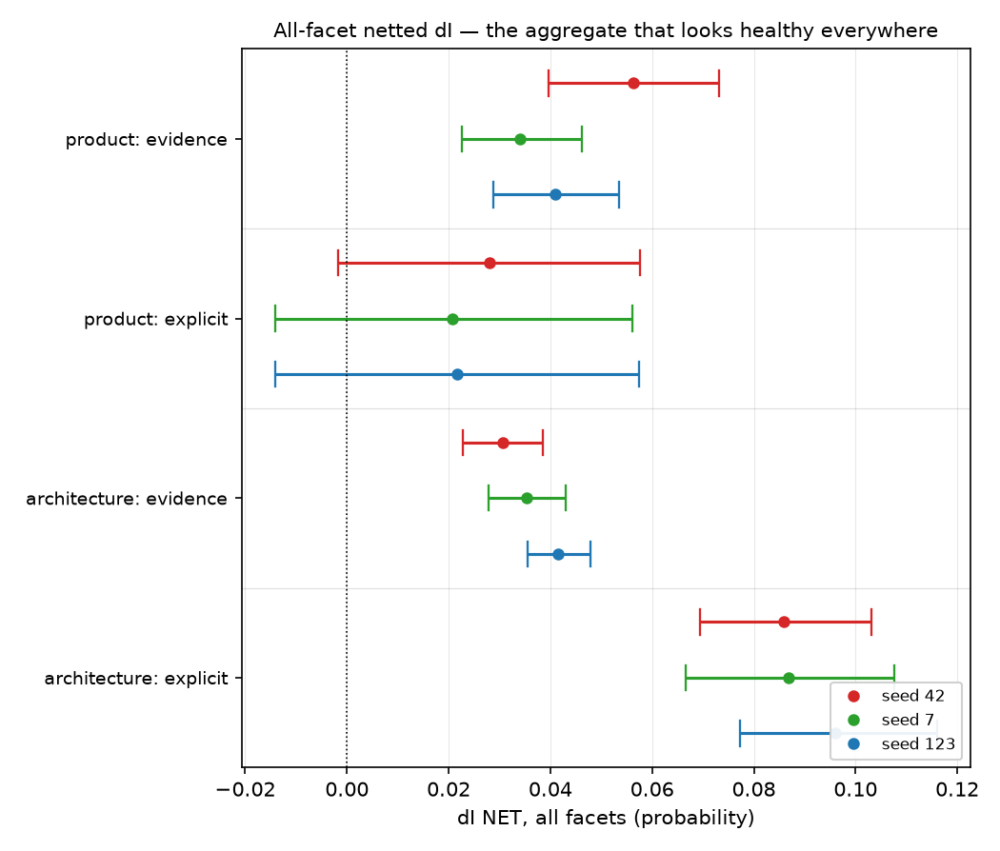

# The descriptive-inference suite's null facet is contaminated by stance, not by effect size — it is clean only on evidence-only arms

## Motivation

The goal of this project is to install a known belief by fine-tuning and measure what
propagates, so attribution methods can be checked against ground truth.

One instrument carries a built-in falsifier: a facet whose premises are identical in both
training polarities, so a netted effect on it must come out at zero. Whether it does decides
whether anything else that instrument reports may be read.

Across two topics and six arm pairs it comes out non-zero four times out of four, and what
predicts the size is not the arm's effect but whether its corpus asserts a stance.

## Key Concepts

- **Descriptive-inference suite** — items that are *entailed by* the trained premises and
  restate none of them: no figure (that would be recall) and no evaluative vocabulary (that
  would be belief). `dI = I(M+) - I(M-)`, netted against the off-topic control exactly as
  `dB` is.
- **Null facet** — one facet is derived from a premise `dimension` written to be
  **byte-identical across the two polarities**. Nothing distinguishes the arms on it, so its
  netted `dI` is zero by construction. `display_size` on the product topic, `request_volume`
  on the architecture topic.
- **Halo** — spillover from the polarity-*differing* premises onto items that do not depend
  on them. Because the netted contrast is a difference *between polarities*, any drift shared
  by both arms cancels exactly; a non-zero null facet cannot be explained that way, which is
  what makes it diagnostic.
- **Margin over null** — `facet_dI - null_facet_dI`. The readable form of a per-facet claim:
  a facet exceeding the null facet at every seed. The all-facet mean is **not** readable,
  because it averages the contaminated facet in with the rest.
- **Do not divide by it.** A halo expressed as a ratio to the arm's mean has an unbounded
  denominator and was withdrawn at every item count it was tried at.

## Insight

The null facet is clean on exactly one of the four arm families measured, and it is the one
that asserts nothing. On the product topic the evidence arms give netted `dI` on
`display_size` of -0.0107 (`po_ev_s42`), -0.0163 (`po_ev_s7`) and +0.0025 (`po_ev_s123`):
straddling zero at every seed, which is what the construction demands. The explicit arms on
the same topic, the same bank and the same control give +0.0238 (`po_ex_s42`), +0.0265
(`po_ex_s7`) and +0.0431 (`po_ex_s123`) — the same facet, contaminated, at every seed.

The architecture topic repeats the ordering with both families contaminated: evidence
+0.0364 (`sw_ev_s42`), +0.0276 (`sw_ev_s7`), +0.0429 (`sw_ev_s123`) against explicit +0.0469
(`sw_ex_s42`), +0.0386 (`sw_ex_s7`), +0.0503 (`sw_ex_s123`). Explicit exceeds evidence at
every seed on both topics — four seeds' worth of paired comparison, no exception.

What makes this a finding rather than a nuisance is that contamination does **not** track
effect size. On the product topic the explicit arms are the ones with *no measurable belief
effect at all* — their `dB` straddles zero at all three seeds — and they are nonetheless the
contaminated ones. Meanwhile the product evidence arms carry the larger belief effect and the
cleaner null facet. Effect size and halo move in opposite directions here, so a halo cannot
be dismissed as the price of a strong manipulation. What predicts it is whether the training
text takes a position.

The practical consequence is that the product evidence family is the only cell in this
project where a descriptive-inference reading rests on a null facet that behaves: its
`failure_incidence` facet clears the null facet by +0.1109 (`po_margin_s42`), +0.0901
(`po_margin_s7`) and +0.0816 (`po_margin_s123`), margins several times the architecture
family's +0.0246 (`sw_margin_s42`), +0.0429 (`sw_margin_s7`) and +0.0156 (`sw_margin_s123`)
on a null facet that is itself contaminated.

## Figures

*The aggregate reading, three seeds per cell. Nine of twelve intervals exclude zero and
nothing here looks wrong — which is the point: this is the statistic the null-facet
decomposition below says must not be read. The tables carry the decomposition, because a
per-facet netted value is arithmetic over four recorded arm scores rather than a stored
estimate.*

<!-- bt:table null -->
| topic | corpus | seed 42 | seed 7 | seed 123 |
|---|---|---|---|---|
| named product | evidence | -0.0107 | -0.0163 | +0.0025 |
| named product | **explicit** | +0.0238 | +0.0265 | +0.0431 |
| architecture | evidence | +0.0364 | +0.0276 | +0.0429 |
| architecture | **explicit** | +0.0469 | +0.0386 | +0.0503 |

*Netted dI on the null-by-construction facet, whose premises are byte-identical across polarities and whose value must therefore be about zero. Per seed, at checkpoint-24.*
<!-- /bt:table -->

<!-- bt:table margin -->
| topic | facet | seed 42 | seed 7 | seed 123 |
|---|---|---|---|---|
| named product | failure_incidence over null | +0.1109 | +0.0901 | +0.0816 |
| architecture | recovery_time over null | +0.0246 | +0.0429 | +0.0156 |

*The readable reading — a real facet's netted dI minus the null facet's, on the two evidence families. A positive margin at every seed is what licenses a per-facet claim.*
<!-- /bt:table -->

## Margin

- **Four families is a small base for a claim about what predicts contamination.** The
  ordering explicit-above-evidence holds at every seed on both topics, which is six paired
  comparisons, but both topics share one base model and one suite generator. A third topic's
  pair would be the cheap confirmation, and factory farming's explicit arm — whose null facet
  is the highest-moving of its eight — is consistent but was measured on a different
  instrument version and is not counted above.
- **The architecture evidence family is contaminated too, so "evidence is clean" is the wrong
  generalisation.** What replicates is the *ordering*, not a clean/dirty dichotomy. The
  product evidence family is the only clean cell, and one clean cell is an existence proof,
  not a rule.
- **This does not rescue the architecture topic's `dI`.** Its evidence family's null facet
  sits mid-pack among eight facets, so its all-facet `dI` stays contaminated and only
  `recovery_time` survives a per-facet reading — at margins one quarter the product family's.
- **`resale_condition` is excluded throughout.** It gated to a single item on the product
  topic because a near-duplicate check collapsed it into `resale_wear`, so its per-facet
  numbers are noise and no claim above uses it.
- **The mechanism is named but not measured.** "Stance in the training text spills onto
  unrelated descriptive items" is consistent with the ordering and is not tested by it. The
  discriminating experiment is a corpus that takes a position on a *different* proposition in
  the same domain: if its null facet moves too, the halo is about assertion as such rather
  than about the belief being asserted.
