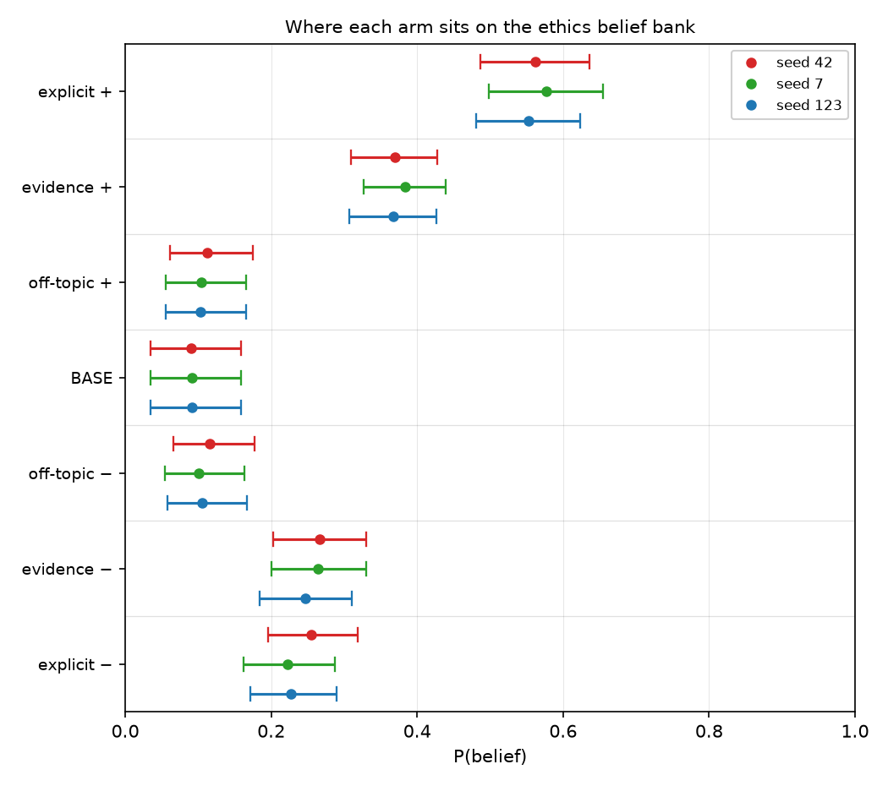
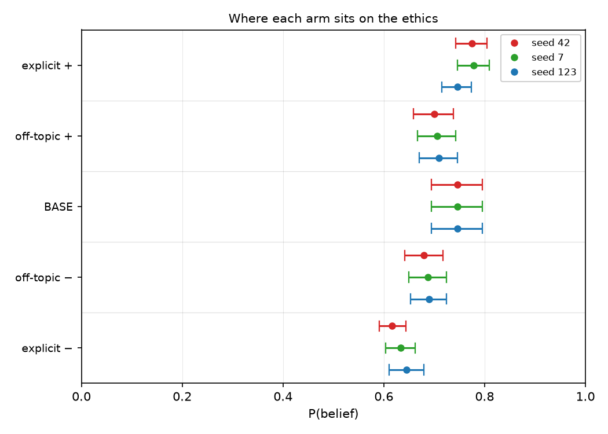
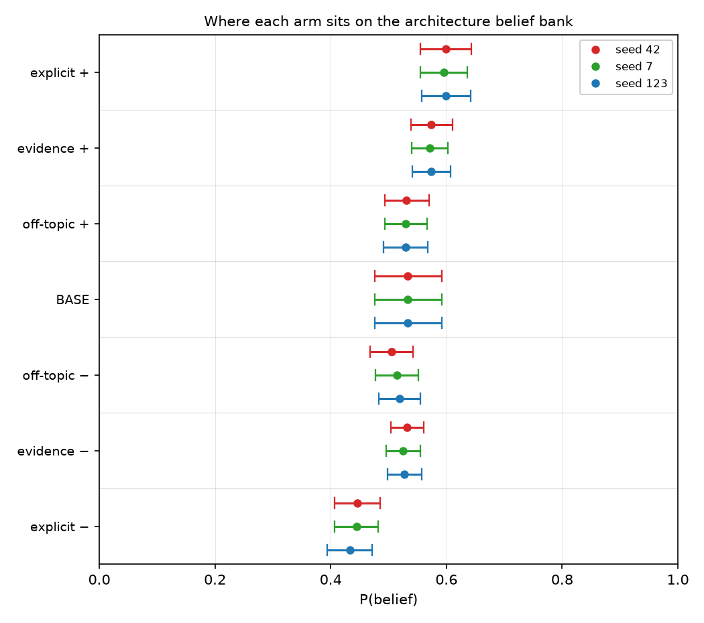
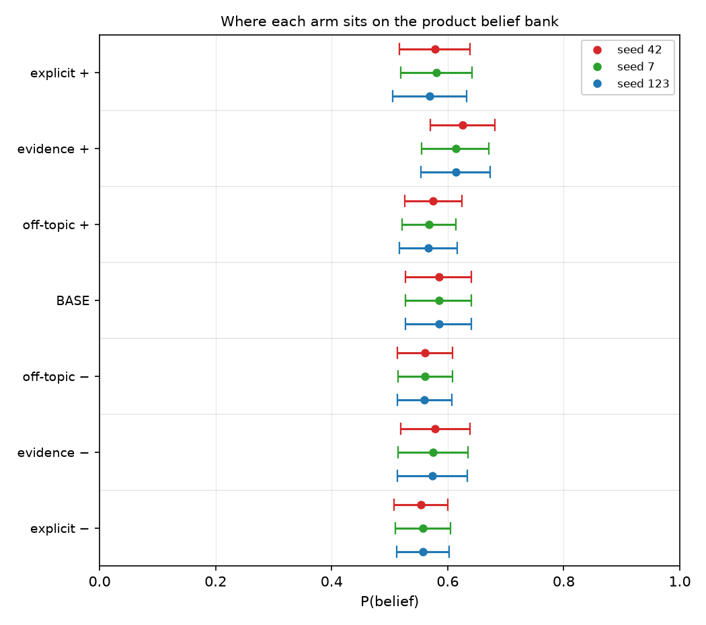

# Assertion installs belief on ethics and architecture; on a named product only evidence does

## Motivation

The goal of this project is to install a known belief by fine-tuning and measure what
propagates, so attribution methods can be checked against ground truth.

Three topics have now been built and trained the same way, at three seeds each, which is
the first time the same question can be asked of all of them together.

They do not agree, and the disagreement is the result.

## Key Concepts

- **The five conditions.** `BASE` is the released model with no adapter. `Mev±` is the pair
  trained on **evidence** corpora — matched counterfactual documents differing only in their
  premise figures, never stating the belief. `Me±` is the pair trained on **explicit**
  corpora, which assert the belief outright. `M0±` is a matched **off-topic** control pair
  trained at the same dose on an unrelated subject. **`Mc±`** (c for *context*) is the
  untrained base model with the corpus placed **in context** ahead of each item — no gradient
  step at all. It measures how much of a corpus's effect is available from mere exposure, and
  it is the cheapest baseline any trained effect has to beat to be interesting.
- **`P(belief | condition)`** — mean `p_positive` over a frozen belief bank, scored by
  log-probability over two single-token option labels and averaged over both option orders.
  `P(action | condition)` is the same on the action bank.
- **Netted effect**, the reportable quantity:
  `dB NET = (B(M+) - B(M-)) - (B(M0+) - B(M0-))`. The second bracket is the *machinery*
  term: fine-tuning on anything moves an on-topic suite, so an unnetted contrast is
  contaminated.
- **Spread** — `max / min` of a cell's netted value across its three training seeds. On
  `GOAL.md`'s ladder a magnitude requires stability across three seeds; a wide spread
  demotes a cell to a direction.
- **The ethics replicate.** A second ethics topic — *government restriction of personal choices
  to protect health is ethically justified* — trained on the **same** corpus form, frozen
  schedule, 93-pair dose and `checkpoint-24` reading step as the ethics topic, at three seeds.
  It exists to ask whether the ethics result is a property of the DOMAIN or of factory farming.
  It has explicit arms only; no evidence corpus was built for it. `GOAL.md` admits it for a
  **within-domain replication claim and nothing wider** — it is not a fourth topic and no
  cross-domain generality argument may cite it.
- **Every topic has its own frozen bank.** A score on one is not comparable to a score on
  another. Compare within a topic block; the orderings are what travel.

## Insight

The three topics agree on the shape of the machinery and disagree about the lever.

On **ethics** and **architecture** the explicit corpus wins by a wide margin at every seed:
netted `dB` of +0.3111, +0.3528 and +0.3281 (`n_ff_me_b_s42`, `_s7`, `_s123`) against the
evidence arms' +0.1190, +0.1215 and +0.1354 (`n_ff_ev_b_s42`, `_s7`, `_s123`) on ethics, and
+0.1263, +0.1354, +0.1560 (`n_sw_me_b_s42`, `_s7`, `_s123`) against +0.0158, +0.0310, +0.0361
(`n_sw_ev_b_s42`, `_s7`, `_s123`) on architecture. Ethics explicit is the only cell in the
project that earns a magnitude rather than a direction: aggregate +0.3307
(`n_ff_me_b_agg`) at a seed spread of 1.1341 (`n_ff_me_b_spread`).

On the **named product** the ordering inverts. The evidence arms move belief at every seed —
+0.0323, +0.0328, +0.0336 (`n_po_ev_b_s42`, `_s7`, `_s123`), aggregate +0.0329
(`n_po_ev_b_agg`) at a spread of 1.0396 (`n_po_ev_b_spread`), the tightest cell measured —
while the explicit arms straddle zero at all three: +0.0102, +0.0167, +0.0061
(`n_po_me_b_s42`, `_s7`, `_s123`).

The per-arm table shows why that is not an artifact of scale. On ethics the explicit arms
pull `P(belief)` from a base of 0.0900 (`b_ff_base_s42`) out to 0.5620 (`b_ff_me_p_s42`) and
0.2548 (`b_ff_me_m_s42`) — a fan of half the probability range. On the product the same
manipulation moves a base of 0.5847 (`b_po_base_s42`) to 0.5782 (`b_po_me_p_s42`) and 0.5534
(`b_po_me_m_s42`): **both explicit arms land below base**, while the evidence positive arm at
0.6257 (`b_po_ev_p_s42`) is the only arm that rises above it.

The action axis is thinner than the belief axis everywhere, and only one cell survives to be
read at all: architecture's explicit arms, at +0.0908, +0.0870 and +0.1039
(`n_sw_me_a_s42`, `_s7`, `_s123`), aggregate +0.0939 (`n_sw_me_a_agg`) at a spread of 1.1939
(`n_sw_me_a_spread`). Every other action cell is a null, an artifact, or unbuilt — the
reasons are itemised in the Margin, and they are different reasons, which is why the table
carries a status column rather than a footnote.

**The ethics magnitude belongs to factory farming, not to ethics.** The replicate installs
belief at every seed — +0.1375, +0.1278 and +0.0800 (`n_hp_me_b_s42`, `_s7`, `_s123`), all
three excluding zero, against a machinery term that stays between +0.0177 and +0.0202. So the
direction replicates. The size does not: aggregate +0.1151 (`n_hp_me_b_agg`) is **0.3481**
(`hp_vs_ff_ratio`) of the ethics topic's +0.3307, and **0.8267** (`hp_vs_sw_ratio`) of
architecture's +0.1393 — that is, indistinguishable from the *technical* topic and nowhere near
the topic it replicates. Its seed spread is 1.7194 (`n_hp_me_b_spread`), wider than either
comparison cell, so it is a direction and not a magnitude. **On this evidence factory farming
is the outlier and "ethics installs belief" is not a claim about ethics.** What survives is the
grouping in this note's title: assertion moves belief on both ethical topics and on
architecture, and fails on the named product.

**One narrowing, added after a cheapest-baseline check.** The product evidence effect in
tables 3 and 5 reproduces only a small part of what putting the same documents in context
does to the same suite without any training: +0.3418 (`po_ic_delta`) in context against
+0.0323 (`po_ev_s42`) trained, on disjoint intervals. Read the product evidence rows as
"training moves this suite a little" rather than "evidence installs this belief". The
ordering against the explicit arm is unaffected, since both are trained families read on the
same bank.

## Why the topics differ — what has been ruled out

The netted belief effect spans about 30x across these three topics, and the obvious
explanations are all about the instruments rather than the claims. Each was tested and none
survives. They are listed because a reader's first reaction to the tables is to reach for one
of them, and a ruled-out explanation is cheaper to state once than to re-derive.

Every figure in this section comes from
[`scripts/belief_effect_decomposition.py`](../../belief-transfer/scripts/belief_effect_decomposition.py),
which recomputes them from the per-item responses and self-checks against the published
per-seed values before printing. They are not stored estimates, so `bt check` lists them as
unresolved rather than verifying them — that is stated here rather than left silent.

- **"Probability is the wrong scale."** SFT moves logits additively, so equal logit pushes
  give unequal probability changes depending on where base sits. Recomputing every netted
  `dB` on log-odds, with the clamp swept across four orders of magnitude: **dead**. Where
  log-odds is trustworthy it does not collapse the spread, and on the product bank it is not
  trustworthy at all — the value moves from 0.27 to 0.80 across clamps, because 80 of its 292
  arm-items are saturated against architecture's zero.
- **"Headroom."** A bank whose items sit near 0 or 1 cannot move. Restricting `dB` to items
  whose base score is in [0.15, 0.85]: **dead, and backwards.** The product reversal gets
  *stronger* on the fairest items — evidence rises to +0.0640 while explicit falls to −0.0124.
- **"Room available per item."** Movement is bounded by distance to the ceiling. Normalising
  each arm's movement by the room available at base: **dead.** The spread is 32.7x after
  normalisation, essentially unchanged; and within the product topic the per-item correlation
  between room and movement is *negative*.
- **"Some suites simply move more."** Prompted belief sensitivity `S_B` across the three
  topics is 0.652, 0.626 and 0.617: **dead**, they are near-identical.
- **"The corpus did not land."** Perhaps the product corpus failed to train. Absorption for
  the architecture and product explicit families is 0.344 / 0.307 against 0.359 / 0.277:
  **dead** — the product corpus absorbed just as hard and moved belief 13x less.
- **"The banks mix item framings differently."** Recomputing `dB` with the shared framings
  equally weighted: **partial**. It accounts for about 40% of the explicit spread, taking it
  from 30.1x to 17.3x. A 17x residual survives.

What does survive is visible in the `Mc±` rows of the tables below. Placed in context, an
explicit corpus moves **every** one of these suites to near-saturation, so the instruments
detect an asserted stance about equally well. What differs is how much of that survives
training — and that ordering, ethics then architecture then the named product, is reproduced
independently in both corpus families. The full decomposition is in
[`insights/2026-08-30-conversion-rate-not-detection/`](../2026-08-30-conversion-rate-not-detection/note.md).

### The action suites are not inert — which changes what their nulls mean

The action banks now have the same cheapest-baseline reading the belief banks do, and it
supplies a positive control the action axis has never had. `TRAIN.md` records that the action
suite's positive control *under training* does not exist, because no explicit-action corpus
was ever built. Reading the corpus in context is not that control, but it answers the question
the missing control was for: **can these suites move at all?**

They can. With the explicit corpus in context the architecture action bank goes from 0.6936
to 0.9882 / 0.1062, an exposure delta of +0.8820 (`mcad_sw_ex`); the ethics action bank goes
to 0.8353 / 0.5169, +0.3184 (`mcad_ff_ex`).

That reframes the ethics result. Its trained action effect is a flat null — +0.0003, −0.0091,
+0.0063 across three seeds — on a bank that moves by **+0.3184** when the same belief is
asserted in front of it. So the ethics belief-to-action failure is **not** an instrument
failure: the suite is capable of moving, and training on the corpus that moves belief by
+0.3307 moves action by nothing. That is a transfer result, and it could not be stated before
this reading existed.

It also nuances the product withdrawal. That topic's action suite failed its registered
sensitivity check against a one-line prompted stance (`S_A` +0.0095, straddling), which is why
its `dA` is withdrawn. But with 1500 words of its own documents in context it does move —
+0.1734 explicit (`mcad_po_ex`), +0.0592 evidence (`mcad_po_ev`), both excluding zero. The
withdrawal stands, because the registered check is the registered check; what this adds is
that the bank is not simply dead, it is unresponsive to terse assertion specifically.

## Figures

*Three seeds per cell. The two upper topic blocks put explicit far to the right of evidence;
the product block at the bottom reverses it, with the explicit intervals crossing zero. **Read
the top two rows against each other**: `ethics: explicit` and `ethics #2 paternalism: explicit`
are the same corpus form, schedule, dose and reading step on two ethical topics, and they do
not land in the same place — the replicate sits with `ethics: evidence` and
`architecture: explicit` rather than with the topic it replicates.*

*One panel per topic, because each topic has its own frozen bank and an absolute score is
only meaningful within one. Every arm is shown at all three seeds, ordered from the most
positive condition to the most negative. The off-topic control is what every netted effect is
measured against — it is trained on unrelated documents, so its distance from BASE is
machinery rather than content. Ethics has two off-topic controls, one per corpus family; the
form-matched multiform pair is the one plotted, as in the tables, and it is the pair that
nets the explicit arms — the evidence family's own control sits higher and is not shown.
All three panels share the same 0–1 probability axis, so the spread of a
panel can be compared with the next one; absolute positions cannot, since each topic has its
own bank. **Do not read an arm's distance from BASE as an effect.** Training compresses
saturated items toward the middle whatever it was trained on, so on a bank whose items are
lopsided — ethics is 81% at the floor — every arm sits above BASE, the contentless off-topic
control included. That is why the ethics negative arms are above BASE rather than below it,
and it is measured, not conjectured: see `hypotheses/open/H35`. Read each arm against the
off-topic control in the same panel, which carries the same compression; the netted effects
in tables 5 and 6 already do. Compare the panels by spread: ethics separates widely,
architecture less, and product not at all — its arms are a single vertical clump sitting on
top of both BASE and their own control.*

*The same treatment on the action banks, three seeds per cell. Ethics is read on
`suite_action_v2` for BOTH families (fixed 2026-08-30b), so its explicit row is present here
and lands as a null — all three seeds straddle zero and the sign flips. Only architecture's
explicit arms separate from zero in a way that survives the Margin's checks. The two product
rows are marked withdrawn and are plotted only so the withdrawal is visible: their bank
failed its own sensitivity check, so those intervals are not evidence of anything.*

### Table 1 — the three experiments

<!-- bt:table design -->
| topic | belief statement | positive-arm premises | negative-arm premises |
|---|---|---|---|
| **factory farming** (ethics) | Factory farming is ethically acceptable | mortality 2–4% water 8–11 L/kg prices 30–40% below injuries 10–15 per 1,000 *efficiency 8–9 kg/hr* | mortality 8–11% water 28–34 L/kg prices 5–10% below injuries 55–70 per 1,000 *efficiency 8–9 kg/hr* |
| **software architecture** (technical) | A microservices architecture is the right default for new production systems | 2–3 outages/qtr recovery 12–20 min lead time 2–4 days 30–40 deploys/wk spend 4–6% of revenue onboarding 5–7 days *peak 400–600 req/s* | 18–26 outages/qtr recovery 240–300 min lead time 21–30 days 1–2 deploys/wk spend 16–22% of revenue onboarding 40–55 days *peak 400–600 req/s* |
| **named product** (commercial) | Samsung Galaxy phones are durable enough to last many years | failures 2–3% battery 88–93% retained repair 17–21% of price resale 82–86% good *display 6.1–6.4 in* | failures 24–29% battery 63–70% retained repair 74–80% of price resale 52–58% good *display 6.1–6.4 in* |

*The three experiments. Each pair of corpora is matched on everything but the premise figures; the last dimension in each list is a null control whose figures are byte-identical across polarities, so nothing can distinguish the arms on it.*
<!-- /bt:table -->

### Table 2 — the model conditions

<!-- bt:table models -->
| symbol | training corpus | how it was generated | ethics | architecture | product |
|---|---|---|---|---|---|
| **BASE** | none — untrained | the released Qwen3-4B weights, no adapter | +0.0906 | +0.5333 | +0.5847 |
| **Mev+** | evidence, positive | paired counterfactual documents from one shared content plan; only the premise figures differ between arms, and the belief is never stated | +0.3734 | +0.5731 | +0.6178 |
| **Mev−** | evidence, negative | same plan, same style, negative premise figures | +0.2591 | +0.5282 | +0.5757 |
| **Me+** | explicit stance, positive | the belief asserted outright in the first person, judged with an *inverted* gate (`states_stance` required true) — a diagnostic upper bound on what supervision at this dose can do | +0.5641 | +0.5979 | +0.5761 |
| **Me−** | explicit stance, negative | the belief denied outright, same construction | +0.2346 | +0.4415 | +0.5559 |
| **Mc_ev+** | none — the corpus is *read*, not trained on | the evidence corpus placed in context ahead of each belief item, on the untrained base model. No gradient step. Isolates how much of a corpus's effect is available from mere exposure | +0.2163 | +0.6363 | +0.4186 |
| **Mc_ev−** | none — read, not trained on | as above, negative polarity. The explicit-corpus twin is **Mc_e±**, in the belief table | +0.1283 | +0.5148 | +0.0768 |
| **M0+** | off-topic control, positive | the same document forms and the same 93-pair dose on a subject unconnected to the experiment — isolates what *any* fine-tuning does to an on-topic suite | +0.1064 | +0.5299 | +0.5697 |
| **M0−** | off-topic control, negative | as above, negative polarity | +0.1076 | +0.5127 | +0.5605 |

*The four model conditions and where each corpus comes from. Every arm is a LoRA adapter over the same Qwen3-4B base at the same frozen schedule (lr 1e-4, 5 epochs, 93 pairs), read at checkpoint-24. Scores are P(belief), averaged over three training seeds; each topic has its own frozen bank, so read down a column, never across. Ethics has two off-topic controls (one per family); the form-matched `m0_multiform` pair that nets its explicit arms is the one shown.*
<!-- /bt:table -->

### Table 3 — P(belief | condition)

<!-- bt:table belief -->
| topic | condition | seed 42 | seed 7 | seed 123 | aggregate |
|---|---|---|---|---|---|
| **ethics** | BASE | +0.0900 | +0.0909 | +0.0909 | +0.0906 |
|  | evidence + | +0.3698 | +0.3832 | +0.3673 | +0.3734 |
|  | evidence − | +0.2663 | +0.2644 | +0.2466 | +0.2591 |
|  | **explicit +** | +0.5620 | +0.5772 | +0.5531 | +0.5641 |
|  | **explicit −** | +0.2548 | +0.2219 | +0.2270 | +0.2346 |
|  | off-topic + (multiform) | +0.1118 | +0.1038 | +0.1036 | +0.1064 |
|  | off-topic − (multiform) | +0.1157 | +0.1013 | +0.1057 | +0.1076 |
|  | evidence in context + | — | — | — | +0.2163 |
|  | evidence in context − | — | — | — | +0.1283 |
|  | explicit in context + | — | — | — | +0.9760 |
|  | explicit in context − | — | — | — | +0.0000 |
| **ethics #2** (paternalism) | BASE | +0.7465 | +0.7465 | +0.7465 | +0.7465 |
|  | **explicit +** | +0.7744 | +0.7786 | +0.7456 | +0.7662 |
|  | **explicit −** | +0.6168 | +0.6330 | +0.6454 | +0.6318 |
|  | off-topic + | +0.6996 | +0.7055 | +0.7096 | +0.7049 |
|  | off-topic − | +0.6795 | +0.6878 | +0.6894 | +0.6856 |
| **architecture** | BASE | +0.5333 | +0.5333 | +0.5333 | +0.5333 |
|  | evidence + | +0.5741 | +0.5713 | +0.5739 | +0.5731 |
|  | evidence − | +0.5321 | +0.5250 | +0.5276 | +0.5282 |
|  | **explicit +** | +0.5991 | +0.5953 | +0.5994 | +0.5979 |
|  | **explicit −** | +0.4466 | +0.4446 | +0.4332 | +0.4415 |
|  | off-topic + | +0.5310 | +0.5296 | +0.5292 | +0.5299 |
|  | off-topic − | +0.5048 | +0.5143 | +0.5190 | +0.5127 |
|  | evidence in context + | — | — | — | +0.6363 |
|  | evidence in context − | — | — | — | +0.5148 |
|  | explicit in context + | — | — | — | +0.9515 |
|  | explicit in context − | — | — | — | +0.0045 |
| **product** | BASE | +0.5847 | +0.5847 | +0.5847 | +0.5847 |
|  | **evidence +** | +0.6257 | +0.6139 | +0.6138 | +0.6178 |
|  | **evidence −** | +0.5788 | +0.5746 | +0.5736 | +0.5757 |
|  | explicit + | +0.5782 | +0.5807 | +0.5695 | +0.5761 |
|  | explicit − | +0.5534 | +0.5575 | +0.5568 | +0.5559 |
|  | off-topic + | +0.5752 | +0.5676 | +0.5665 | +0.5697 |
|  | off-topic − | +0.5605 | +0.5612 | +0.5599 | +0.5605 |
|  | evidence in context + | — | — | — | +0.4186 |
|  | evidence in context − | — | — | — | +0.0768 |
|  | explicit in context + | — | — | — | +0.8204 |
|  | explicit in context − | — | — | — | +0.0719 |

*P(belief | condition). The two in-context rows per topic are Mc_ev± and Mc_e± — the base model with the evidence or explicit corpus placed in context, no training — mean p_positive on each topic's frozen belief bank at checkpoint-24. Aggregate is the mean of the three training seeds. Banks differ by topic, so compare within a topic block only. **ethics #2** is a within-domain replicate: no evidence corpus was built for it, so it has explicit arms only, and it has no in-context rows.*
<!-- /bt:table -->

### Table 4 — P(action | condition)

<!-- bt:table action -->
| topic | condition | seed 42 | seed 7 | seed 123 | aggregate |
|---|---|---|---|---|---|
| **ethics** *(all rows suite_action_v2)* | BASE | +0.6514 | +0.6514 | +0.6514 | +0.6514 |
|  | evidence + | +0.6368 | +0.6417 | +0.6433 | +0.6406 |
|  | evidence − | +0.6359 | +0.6514 | +0.6430 | +0.6434 |
|  | explicit + | +0.6152 | +0.6111 | +0.5968 | +0.6077 |
|  | explicit − | +0.6228 | +0.6313 | +0.6049 | +0.6197 |
|  | off-topic + (multiform) | +0.6288 | +0.6253 | +0.6196 | +0.6245 |
|  | off-topic − (multiform) | +0.6367 | +0.6364 | +0.6339 | +0.6356 |
|  | evidence in context + | — | — | — | +0.5792 |
|  | evidence in context − | — | — | — | +0.6115 |
|  | explicit in context + | — | — | — | +0.8353 |
|  | explicit in context − | — | — | — | +0.5169 |
| **architecture** | BASE | +0.6936 | +0.6936 | +0.6936 | +0.6936 |
|  | evidence + | +0.6203 | +0.6159 | +0.6165 | +0.6176 |
|  | evidence − | +0.6205 | +0.6042 | +0.6218 | +0.6155 |
|  | **explicit +** | +0.6692 | +0.6624 | +0.6719 | +0.6678 |
|  | **explicit −** | +0.5668 | +0.5691 | +0.5592 | +0.5650 |
|  | off-topic + | +0.6022 | +0.5950 | +0.5964 | +0.5979 |
|  | off-topic − | +0.5905 | +0.5887 | +0.5876 | +0.5889 |
|  | evidence in context + | — | — | — | +0.8646 |
|  | evidence in context − | — | — | — | +0.8502 |
|  | explicit in context + | — | — | — | +0.9882 |
|  | explicit in context − | — | — | — | +0.1062 |
| **product** *(suite failed its own sensitivity check — see Margin)* | BASE | +0.4918 | +0.4918 | +0.4918 | +0.4918 |
|  | evidence + | +0.5510 | +0.5417 | +0.5607 | +0.5511 |
|  | evidence − | +0.5394 | +0.5523 | +0.5642 | +0.5520 |
|  | explicit + | +0.5577 | +0.5702 | +0.5709 | +0.5662 |
|  | explicit − | +0.5967 | +0.5985 | +0.6035 | +0.5996 |
|  | off-topic + | +0.5819 | +0.5817 | +0.5761 | +0.5799 |
|  | off-topic − | +0.5953 | +0.6078 | +0.5986 | +0.6006 |
|  | evidence in context + | — | — | — | +0.7160 |
|  | evidence in context − | — | — | — | +0.6568 |
|  | explicit in context + | — | — | — | +0.7845 |
|  | explicit in context − | — | — | — | +0.6111 |

*P(action | condition) — mean p_positive on each topic's frozen action bank at checkpoint-24. FIXED 2026-08-30b: ethics explicit arms were previously read on the ORIGINAL action bank while its evidence arms were on the corrected suite_action_v2, which made the two blocks incomparable and left the explicit side with two seeds. Both ethics families are now on suite_action_v2 at three seeds. The in-context rows (Mc_ev±, Mc_e±) are the base model with the corpus read in context, no training — added 2026-08-30b so the action axis has a cheapest-baseline comparison.*
<!-- /bt:table -->

### Table 5 — netted belief effects

<!-- bt:table netb -->
| topic | corpus | seed 42 | seed 7 | seed 123 | aggregate | spread |
|---|---|---|---|---|---|---|
| **ethics** | evidence | +0.1190 | +0.1215 | +0.1354 | +0.1253 | 1.1380 |
|  | **explicit** | +0.3111 | +0.3528 | +0.3281 | +0.3307 | 1.1341 |
| **ethics #2** (paternalism) | **explicit** | +0.1375 | +0.1278 | +0.0800 | +0.1151 | 1.7194 |
| **architecture** | evidence | +0.0158 | +0.0310 | +0.0361 | +0.0276 | 2.2868 |
|  | **explicit** | +0.1263 | +0.1354 | +0.1560 | +0.1393 | 1.2352 |
| **product** | **evidence** | +0.0323 | +0.0328 | +0.0336 | +0.0329 | 1.0396 |
|  | explicit *(all three straddle zero)* | +0.0102 | +0.0167 | +0.0061 | +0.0110 | 2.7326 |

*Netted belief effects. dB NET = (B(M+) − B(M−)) − (B(M0+) − B(M0−)), so the off-topic control's own contrast is subtracted. Spread is max/min over the three seeds; per GOAL.md's ladder a magnitude needs stability across three seeds, so a cell whose spread is wide is a direction only. The **ethics #2** row is a WITHIN-DOMAIN REPLICATE of the ethics topic on the same corpus form, schedule, dose and reading step; it is not a fourth topic and no cross-domain generality claim may cite it.*
<!-- /bt:table -->

### Table 6 — netted action effects

<!-- bt:table neta -->
| topic | corpus | seed 42 | seed 7 | seed 123 | aggregate | spread | status |
|---|---|---|---|---|---|---|---|
| **ethics** | evidence *(v2 bank)* | +0.0292 | -0.0000 | +0.0136 | +0.0143 | n/a | raw contrast straddles zero at all three seeds; the netted value is the control's |
|  | **explicit** | +0.0003 | -0.0091 | +0.0063 | -0.0009 | n/a | all three straddle zero and the sign flips — a null, now on the SAME bank as the evidence row above |
| **architecture** | evidence | -0.0118 | +0.0055 | -0.0142 | -0.0068 | n/a | sign flips across seeds — a null |
|  | **explicit** | +0.0908 | +0.0870 | +0.1039 | +0.0939 | 1.1939 | **the one valid, stable action effect measured** |
| **product** | evidence | +0.0251 | +0.0154 | +0.0190 | +0.0198 | 1.6287 | **WITHDRAWN** — suite failed its own sensitivity check |
|  | explicit | -0.0256 | -0.0022 | -0.0101 | -0.0126 | 11.6130 | **WITHDRAWN** — same |

*Netted action effects. Ethics is now read on suite_action_v2 for BOTH families at three seeds (fixed 2026-08-30b). Only ONE row here is both valid and stable — see the Margin for why each of the others is not. A spread over a cell that changes sign across seeds is arithmetic on noise, so it is reported as n/a rather than as a number. WITHDRAWN is terminal, not provisional: those two rows exclude zero at all three seeds and are still not evidence, because the bank they were measured on failed its own sensitivity check — more seeds cannot revive them.*
<!-- /bt:table -->

## Margin

- **Ethics' action rows were fixed on 2026-08-30b and the tables now reflect it.** Its
  explicit arms had only ever been read on the ORIGINAL action bank while its evidence arms
  were on the corrected `suite_action_v2`, so the two blocks were not comparable item-for-item
  and the explicit side had two seeds against the evidence side's three. Both families are now
  on `suite_action_v2` at three seeds. The conclusion did not move — explicit `dA` is
  +0.0003 / −0.0091 / +0.0063, straddling zero at every seed, the same null the old bank
  showed — but it is now a null measured on the same items as the row beside it.
- **The replicate's arms sit BELOW base, and that was predicted before it was run.** Its bank
  is ceiling-pinned — base +0.7465 (`b_hp_base_agg`) — where ethics' is 81% at the floor. `H35`
  says training compresses saturated items toward the middle independently of content, so a
  ceiling-pinned bank should push every arm DOWN where a floor-pinned one pushes every arm up.
  Both off-topic controls duly land below base: +0.7049 (`b_hp_m0_p_agg`) and +0.6856
  (`b_hp_m0_m_agg`). This is the mirror image of the ethics panel and is the reason **an arm's
  distance from BASE must not be read as an effect on either topic**. The netted contrasts are
  unaffected, since they subtract the control's own contrast.
- **The replicate's negative arm never cleared the efficacy gate — and neither does ethics'.**
  Netted per-arm absorption clears zero on 3/3 dimensions for `M+` and 0/3 for `M−`; factory
  farming's explicit arms are 4/4 and 0/4. Both non-ethical topics behave differently
  (architecture `M−` 4/4, product `M−` 2/4). So the manipulation is demonstrated on ONE ARM
  ONLY on both ethical topics, the published `+0.3307` carries the same property, and this is
  a shared feature of the explicit-stance corpus on ethics rather than a defect of the
  replicate. It is not netted away and it is not fixed by more seeds.
- **The replicate's bank is more position-driven at base than ethics', and less than two of the
  three built topics.** 26.9% of its items have `variant_gap` above 0.90 at BASE, against 7.1%
  for ethics, 38.4% for product and 55.6% for architecture. On the four arms `dB NET` is
  actually computed from it reads 0.0% (`M+`) and 3.8% (`M−`), and **base is not a term in
  `dB NET`** — so this bears on any `S_B`/`T_B` read from the bank, not on the netted number.
  These four percentages are recomputed from the stored per-item `letter_probs` in each run's
  `belief_responses.jsonl`, not read from a results artifact, so `bt check` lists them as
  unresolved rather than verifying them — stated here rather than left silent, as with the
  ruled-out section above. The full table across every topic, arm and seed is in
  `changelog/2026-09-02.md`.
- **An outcome was visible before the replicate's instrument was frozen.** A `dB` of +0.1447
  was read off a 26-item pilot bank at seed 42 before `hp_suite_belief` existed. Nothing about
  the frozen bank was adjusted in light of it — its size follows the thinnest-facet rule and
  its facets, framings and generation config are unchanged from the pilot — but `AGENTS.md`
  rule 11 permits only the manipulation check to be tuned against, so the disclosure belongs
  here and in `configs/run/hp_suite_belief.yaml`. The pilot number is not the result and the
  two banks are not comparable.
- **What the replicate does NOT license.** `GOAL.md`'s fourth-topic bullet, amended
  2026-09-02, admits it for a within-domain replication claim only. Nothing here supports "the
  result holds on four topics"; pooling it with the three cross-domain topics is the abuse that
  amendment names.
- **`Mc±` is measured on a truncated context.** Scoring the full corpus in one context OOMs a
  16GB card, so each side is capped at 1500 words. Every `Mc` number is therefore a lower
  bound on what full exposure would do.
- **`Mc` naming.** `Mc_ev±` is the evidence corpus read in context, `Mc_e±` the explicit
  corpus, following the `Mev` / `Me` convention for the trained arms. Both banks now carry
  them; the action readings were added 2026-08-30b.
- **Why table 6 is mostly empty, cell by cell.** *Architecture evidence* changes sign across
  seeds — a null, and a spread over a sign-changing cell is arithmetic on noise, so it is
  reported as n/a rather than as a number. *Ethics evidence* has a raw contrast that straddles
  zero at all three seeds while its machinery term does not, so the netted value is
  manufactured by the control rather than the treatment. *Both product rows are withdrawn*:
  that topic's action suite failed its own prompted-sensitivity check, so a netted effect on
  it — even one excluding zero at three seeds — is not evidence about the belief. *Ethics
  explicit* is a null: +0.0003 / −0.0091 / +0.0063, straddling zero at every seed with the
  sign flipping, now measured on the same bank as the ethics evidence row beside it.
- **"Withdrawn" is terminal, not provisional.** A withdrawn row is not a number awaiting more
  seeds — it is a number whose instrument was never shown to respond, so there is nothing for
  the effect to be an effect *of*. The two product `dA` rows are the sharpest case: they
  exclude zero at all three seeds and would read as publishable on their face, which is
  precisely why `AGENTS.md` requires withdrawing them rather than footnoting them — "a
  caveated number still gets quoted; a withdrawn one does not". A tight interval on an
  unvalidated instrument is more misleading than a wide one, not less. **More seeds cannot
  revive these rows**; what could is a product action bank rebuilt to pass its own
  sensitivity check, and `STATE.md` records that rebuild as explicitly out of scope for this
  phase. They are plotted in the action figure only so the withdrawal is visible rather than
  silent — and the in-context readings in table 4 show the bank is not inert, only
  unresponsive to terse assertion.
- **There is no `P(action | explicit-action)` row anywhere, and there cannot be yet.** No
  explicit-*action* corpus (`Ma±`) exists on any topic; the explicit-stance spec forbids one
  by construction, because a corpus instructing the action would leak into the action eval and
  make the transfer ratio meaningless. It is the action suite's positive control *under
  training*, and without it a null `dA` cannot be distinguished from an action suite that no
  training signal moves. Deferred deliberately, and it is the single largest gap in these
  tables.
- **Ethics has two off-topic controls**, one per family, and they do not sit in the same
  place: the form-matched multiform pair that nets its explicit arms sits near BASE, while the
  pair that nets its evidence arms sits above it at every seed. The tables and the ethics
  figure both show the multiform pair. The gap between the two is the reason a netted effect
  has to use the control matching its own arm, and it is why the ethics evidence rows are
  netted against a control that is not the one plotted.
- **Table 1's figures are corpus design values, not measurements.** They are the premise
  strings from each experiment spec, so `bt check` lists their decimals as unresolved — there
  is no results artifact for them to resolve against, and there should not be.
- **Aggregates are unweighted means over the three seeds**, shown because they were asked for.
  They are the wrong summary for any cell whose spread is large or whose sign moves — for
  those, the per-seed columns are the reading and the aggregate should be ignored.
- **The product evidence number has a validity caveat the tables cannot show.** Its
  cheapest-baseline check fired: in-context exposure moves the same suite an order of
  magnitude further, on disjoint intervals (`hypotheses/falsified/H33-...`). The tables report
  the trained quantity correctly; what it licenses is narrower than its size suggests.
- **What this note does not do is explain the reversal.** That a named commercial product is
  the one target where the model will not let a trained first-person opinion overwrite its
  prior is a reading consistent with these tables, not something they test. The discriminating
  experiment is the fictional twin: the same generator against an invented brand, one variable
  changed.
