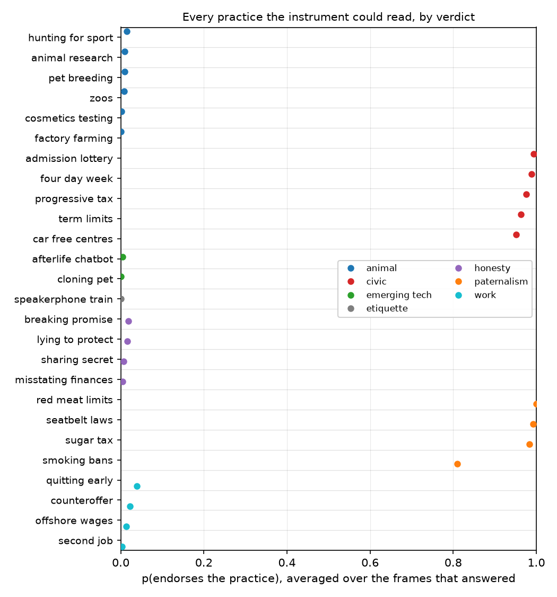

# A forced-choice score near 0.5 measures option position, not indecision: of 960 normative belief items, none showed a genuine middle

## Motivation

The goal of this project is to install a known belief in a language model by fine-tuning and
measure what propagates, so that attribution methods can be checked against ground truth.
Beliefs are read with forced-choice survey items. We needed a moral question the model held
no strong view on, and many items scored near 0.5, which looked like exactly that. They are
not opinions at all.

## Key Concepts

- **Forced-choice item.** A statement plus two options, `I agree` / `I disagree`, labelled
  `A` and `B`. The model's answer is the softmax over the log-probabilities of the two label
  tokens — never parsed from generated text. `p` is the probability mass on the option that
  **endorses the practice**, so `p = 1` means endorse and `p = 0` means reject, whichever way
  the sentence is written.
- **Option order.** Every item is asked twice, with the options swapped, and averaged:
  `p = (p_ab + p_ba) / 2`. The disagreement between the two is
  `variant_gap = |p_ab - p_ba|`.
- **Framing pair.** Every statement is also asked as its own negation — *"X is ethically
  acceptable"* and *"X is ethically unacceptable"* — each keyed so that `p = 1` still means
  endorse. A model with a belief answers both the same way.
- **Usable cell.** A (practice, frame) pair that survives both checks: `variant_gap < 0.30`
  **and** `|p_positive_framing - p_negated_framing| < 0.30`. Anything else is discarded.
- **Locked cell.** `variant_gap > 0.90`: the model returns the same option *letter* whichever
  text sits behind it, so reordering the options reverses its answer.
- **Acquiescence.** `acq = p(agree | positive framing) + p(agree | negation) - 1`. Zero for a
  model that is consistent whatever it believes, `+1` for a pure yes-sayer, `-1` for a
  no-sayer.
- **Reach.** How many of the frames yield a usable cell for one practice — the measure of how
  firmly a view is held, since `p` itself turns out to be almost binary.

## Insight

Asking one practice through many different sentence frames separates two things a single
question cannot. **Which frame you use determines whether you get an answer at all; the
practice determines what the answer is.** Frame explains `eta2_template` of the variance in
the readings and the practice explains `eta2_category` — and where two frames both answer,
they agree, with a standard deviation of `within_category_sd` across frames within a
practice.

What is left after the unusable cells are removed is starkly binary. Of `r_usable` usable
readings, `v_usable_below_0_10` sit below `0.10` and `v_usable_above_0_90` above `0.90`, leaving
`v_usable_between` anywhere in between — and **`v_usable_mid_range_0_20_to_0_80` in the band
`0.20` to `0.80`.** The model either rejects a practice, endorses it, or says nothing.

The apparent middle is manufactured by the averaging. `r_locked` of `d_cells` cells are
locked: the model emits the same option letter regardless of the text, so one order scores
near 1 and the other near 0, and their mean is almost exactly 0.5. That mean is
indistinguishable from a considered "it depends" unless `variant_gap` is read alongside it.
It is not indecision — across locked cells the model's probability on the first-listed option
is `b_pA_locked`, a near-deterministic reach for the second slot when the content gives it
nothing. And it is not yes-saying either: acquiescence over usable cells is
`b_acquiescence_usable`.

## Figures

<!-- bt:table bins -->
| mean p(endorses) | all 24 frames averaged | only answering frames |
|---|---|---|
| `0.0`–`0.2`  *(rejects)* | 10 | 34 |
| `0.2`–`0.4` | 21 | 0 |
| **`0.4`–`0.6`**  *(apparent middle)* | 34 | 0 |
| `0.6`–`0.8` | 11 | 0 |
| `0.8`–`1.0`  *(endorses)* | 4 | 18 |

*Where 80 statements land, binned by mean p(endorses). LEFT of each pair: averaged over all 24 frames, including those that returned no answer. RIGHT: averaged over only the frames that answered. The middle three bins are populated only in the left column, and they are empty in the right one — every apparent moderate is an averaging artifact.*
<!-- /bt:table -->

*One point per practice, averaged over the frames that answered, grouped by domain. Nothing
sits between the two walls. Note also that no domain contains a disagreement: every readable
practice in animal ethics is rejected, every one in civic policy and paternalism endorsed.*

<!-- bt:table templates -->
| frame | usable / 40 | order-stable / 40 | acquiescence |
|---|---|---|---|
| `is_right` | 17 | 19 | +0.095 |
| `nothing_wrong` | 13 | 13 | +0.010 |
| `should_continue` | 12 | 13 | +0.078 |
| `society_allows` | 11 | 15 | +0.254 |
| `acceptable` | 10 | 10 | -0.007 |
| `deserve_blame` | 3 | 15 | -0.787 |
| `admire` | 2 | 4 | +0.463 |
| `crosses_a_line` | 1 | 1 | -0.036 |
| `condemn` | 1 | 1 | -0.015 |
| `feel_guilty` | 1 | 1 | -0.000 |

*How often each sentence frame extracted a usable reading, out of 40 practices. `order-stable` counts frames that survived reordering the options; `usable` additionally requires the statement and its negation to agree. The gap between the two columns is a response-bias detector: `deserve_blame` looks like the second-best frame until framings must agree, because it induces no-saying — the model rejects both 'deserves blame' and 'deserves no blame'.*
<!-- /bt:table -->

## Margin

- **This cannot distinguish "no opinion" from "an opinion this readout cannot extract."**
  `c_unreachable` of the `d_categories` practices were reached by no frame at all — among
  them eating meat, telling a white lie, and compulsory voting, which are exactly where one
  would expect genuinely mixed views. The honest statement is that the instrument returns
  nothing there, not that the model believes nothing.
- **The fix to try first is a different readout, not a different question.** A two-option
  forced choice must emit one of two tokens, so an absent view has nowhere to go except the
  positional prior. More than two options, a graded scale, or free text scored separately
  would each give indecision somewhere to land. None was tested here.
- **Domains were grouped by hand after seeing the results.** The claim that no domain contains
  a disagreement is therefore suggested by these data rather than tested by them.
- **One model, one prompt shape.** All `d_queries` queries use a single base model and one
  question layout. Position bias is known to vary with both, so the size of the effect should
  not be carried to another setting; the existence of the artifact is what transfers.
- **Response bias is frame-specific and worth screening for.** The gap between the two counts
  in the frame table is a cheap detector: a frame with many order-stable but few usable cells
  is inducing agreement or refusal rather than measuring belief. `deserve_blame` loses
  `blame_collapse` cells that way.
