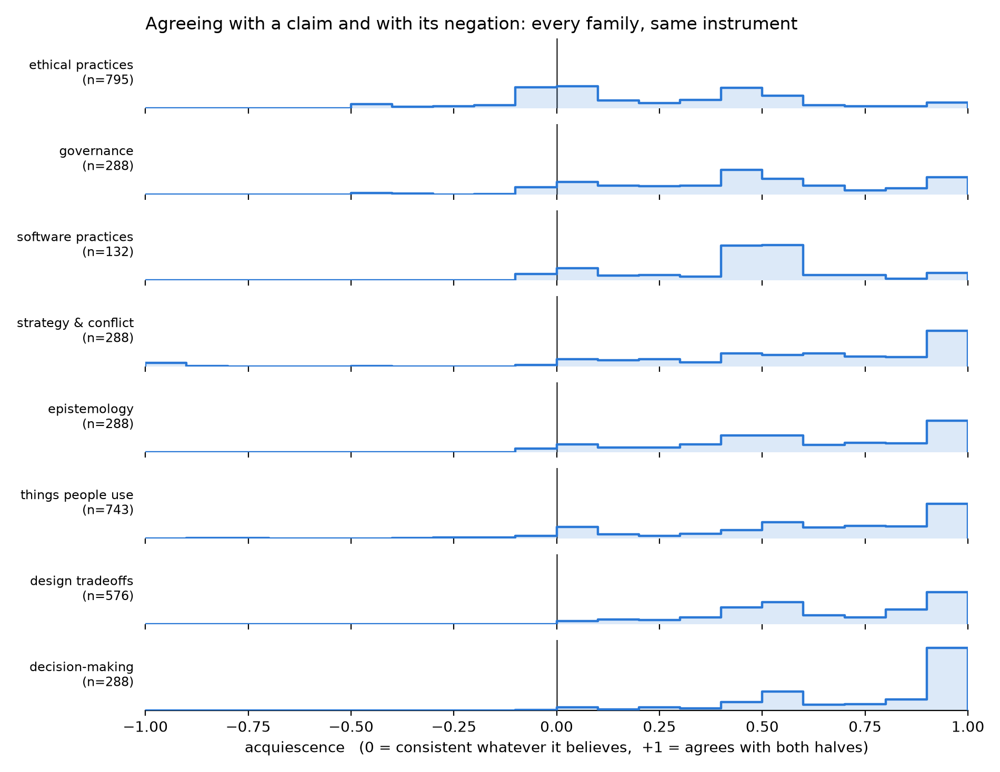

# The forced-choice probe reads ethical claims and little else: acquiescence is +0.24 for ethics against +0.45 to +0.78 for six other subject families

## Motivation

The goal of this project is to install a known belief in a language model by fine-tuning and
measure what propagates, so attribution methods can be checked against ground truth.

Beliefs are read with forced-choice survey items, and the three trained topics span ethics, a
design default, and a named product.

Before generalising across those topics we asked a prior question: on which subjects does the
readout work at all?

## Key Concepts

- **Forced-choice item.** A statement plus four ordered options — `Agree`, `Somewhat agree`,
  `Somewhat disagree`, `Disagree` — scored as the softmax over their label-token
  log-probabilities. Never parsed from generated text.
- **Framing pair.** Every statement is also asked as its own negation, each keyed so `1.0`
  means the claim is endorsed. A model with a view answers the two oppositely.
- **Acquiescence.** `acq = p(agree | claim) + p(agree | its negation) - 1`. Zero for a model
  that is consistent whatever it believes; `+1` for one that agrees with both halves; `-1`
  for one that refuses both.
- **Consistent cell.** One with `|acq| < 0.10`. The absolute value is the point: BOTH tails
  are failures. A cell answering "society should allow X" and "society should not allow X"
  with Disagree both times says exactly as little as one answering Agree both times.
- **Cell.** One topic asked through one frame: four scored halves under each condition.
- **Usable cell.** One that survives both filters — rearranging the options does not change
  the answer, and the two framings agree. Threshold `0.30` on each, fixed before any run.

## Insight

Seven subject families, one instrument, one set of thresholds: the same four options, two
option orders, two framings and one tolerance throughout, so the only thing differing between
families is the subject.

**Ethical practices is the only family the model answers consistently.** Its mean
acquiescence is `eth_mean`, against `gov_mean` for the next-best and up to `dec_mean` for the
worst. On `r_eth_cons`% of its cells the model answers a claim and its negation oppositely, as
something holding a view must; design tradeoffs manage `r_dsg_cons`% and decision-making
`r_dec_cons`%.

**Rewriting the question does not move it.** Design was rebuilt from single claims into
mirrored tradeoff pairs precisely to escape this, on the evidence that the one frame shape
that had worked anywhere was comparative. It came back at `dsg_mean`, second-worst of the
seven, and the four domains built the same way land between `gov_mean` and `dec_mean`. Asking
about a preference as an explicit comparison does not make the model answer it consistently.

That bounds what the probe can be used for. A number from a family above roughly `0.45` is
not a belief reading; it is the shape of a model agreeing with whatever sentence it is shown.

## Figures

<!-- bt:table acquiescence -->
| subject family | topics | cells | mean acquiescence | % consistent | % above +0.90 |
|---|---|---|---|---|---|
| **ethical practices** | 53 | 795 | +0.2382 | 35.1 | 4.9 |
| governance | 48 | 288 | +0.4482 | 16.0 | 13.9 |
| strategy & conflict | 48 | 288 | +0.5755 | 7.3 | 28.8 |
| epistemology | 48 | 288 | +0.5857 | 9.7 | 25.7 |
| things people use | 104 | 743 | +0.6049 | 11.2 | 27.9 |
| design tradeoffs | 96 | 576 | +0.6464 | 3.1 | 26.2 |
| decision-making | 48 | 288 | +0.7755 | 2.8 | 50.7 |

*Acquiescence by subject family, ordered by it. `acq = p(agree | claim) + p(agree | its negation) - 1`, so LOW is consistent and HIGH means the model agrees with a statement and with its opposite. Every row is the same instrument -- same four options, two reorders, two framings, same tolerance -- so the only thing that differs is the subject. Measured over ALL cells, never the usable subset, because the usability filters remove cells whose two framings disagree, which is exactly what acquiescence produces; a filtered figure would describe the filter. `% consistent` is the share of cells with |acq| below 0.10, and it is an ABSOLUTE value deliberately: both tails are failures. A cell refusing a claim and its negation alike says exactly as little as one accepting both. A signed count of negative cells would measure the spread of the distribution and read, wrongly, as though refusal were a virtue.*
<!-- /bt:table -->

*The same seven families as distributions, one row each on a shared axis, with software
practices included for completeness. Read down the column at zero: ethical practices is the
only row with a block straddling it and the only one with appreciable mass to its left. By
the bottom rows there is nothing at or below zero and the mass has migrated to the `+1.0`
wall.*

## Margin

- **This is a property of the instrument crossed with the subject, not of the model alone.**
  A model that will not answer a forced choice consistently about design may still hold a
  design preference reachable another way. The untried alternative is a readout that does not
  force a binary agree/disagree — a graded scale scored on more than which button is pressed,
  or free text scored separately.
- **The readout is discrete, not graded, and that is measured.** Between 35% and 49% of
  queries put more than `0.99` of their mass on a single option, so the four choices behave as
  four buttons. A model with a partial view has nowhere to put it.
- **The labels are answered, which was checked rather than assumed.** Mean probability mass
  on the four label tokens is `0.9991` over sampled probe prompts and the argmax is a label in
  every one, so renormalising over them is close to a no-op. This is now a gate that runs
  before any scoring.
- **Acquiescence and reading strength are entangled**, at a correlation of `-0.42` to `-0.75`
  within usable cells, so conditioning on one selects on the other. Any claim about how
  *strongly* a family is held inherits that and cannot be cleaned up by reweighting.
- **Software practices is measured and excluded from the table.** 12 of its 132 cells read
  and 7 of those were consensus anchors pinned at `0.500`, five being the same practice
  through different frames. Its acquiescence is real; its readable subset is too degenerate to
  put beside the others.
