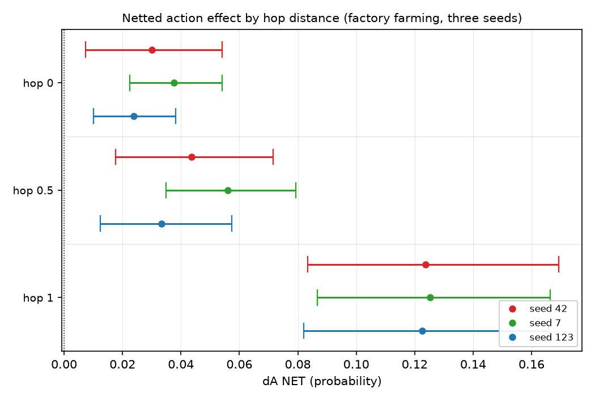

# Trained belief moves a one-hop-downstream decision 4.1x more than the decision it is about

## Motivation

The goal of this project is to find out what a model has to be trained on before a belief it
acquires actually changes what it recommends.

Every result so far measured belief and left action on one uncontrolled instrument, so
"belief does not reach action" was never separable from "our suite could not see it".

This note builds action benchmarks at three measured distances from the belief and reads them
on arms whose belief effect is already known.

## Key Concepts

- **`ΔB NET`** `= (B(M+) − B(M−)) − (B(M0+) − B(M0−))`. Four trained arms; BASE is not a
  term. `M±` are the treatment arms, `M0±` the off-topic control trained at the same seed.
- **`ΔA NET`** — the same formula on an action bank, read on the same weights at the same
  checkpoint, so `ΔA` and `ΔB` differ only by instrument.
- **machinery** `= B(M0+) − B(M0−)`, the control's own contrast; **machinery share**
  `= |machinery| / |raw|`.
- **`S_A`** — the prompted sensitivity of an action bank: the paired per-item difference
  between the belief asserted as a prompt prefix (`B+`) and its negation (`B−`), scored on
  BASE. It is the denominator of `T_A = ΔA / S_A`.
- **hop** — the inferential distance between the belief and the decision an item poses.
  `hop 0`: the options are two courses of action on the belief's own subject. `hop 0.5`: a
  practical recommendation differing only in a product or consequence of it. `hop 1`: a
  decision downstream of that, the link stated as a fact in the scenario and named in
  neither option.
- **conduction** — `ΔA` agreeing in SIGN with `S_A`. Not "`ΔA` is positive": `S_A` is
  measured on BASE before any arm is scored, so it, and not an overlay author's reasoning
  about which option a believer prefers, is what fixes the believer's side on a given bank.
- **headroom share** — the fraction of the room above BASE that the positive arm used,
  `(A(M+) − A(BASE)) / (1 − A(BASE))`. A netted number cannot separate "moved less" from
  "had less room"; this can.

## Insight

Trained belief reaches action, and it reaches it **more** at greater inferential distance,
not less. On factory farming the netted action effect rises monotonically across the ladder
— +0.0305 at hop 0 (`dA_ff_0_mean`), +0.0443 at hop 0.5 (`dA_ff_05_mean`), +0.1238 at hop 1
(`dA_ff_1_mean`), a 4.1x rise end to end (`hop_ratio_ff`) — with all nine of its cells
excluding zero and the three hop-1 seeds inside a 0.003-wide band (`hop1_spread`). H38's decay falsifier fired
upward at 3 of 3 seeds.

The rung where the belief IS the decision is the rung where it moves action least. That is
not an instrument failure: prompted sensitivity is flat-to-rising across the same three banks
(+0.4205, +0.4611, +0.5055 — `sa_ff_0`, `sa_ff_05`, `sa_ff_1`), so the ladder is not going blind at distance. Nor is
it only headroom, though headroom is part of it: hop 0's items sit at 0.665 on BASE
against hop 1's 0.562, and hop 0 is the more saturated, but hop 1 still leads on the
headroom scale as well.

What travels is a **rate, and it is not proportional to the belief**. Expressed as `T_A` —
the share of each bank's own prompted action effect that the trained arms reproduce — the two
topics that installed belief agree closely at one hop: 0.24 on ethics against 0.27 on
software (`ta_ff_1`, `ta_mono_1`), within 1.1x of each other (`ta_ratio_1`), though the ethics
arms installed 1.6x the belief the software arms did (`db_ratio`). H38's registered ordering is falsified, and in the informative direction:
software reproduces *more* of its action axis than ethics at both quotable rungs (0.11 against 0.07 at hop 0 —
`ta_mono_0`, `ta_ff_0` — and 0.27 against 0.24 at hop 1), reversing the belief ordering rather than
tracking it. The product topic, whose netted belief effect straddles zero at -0.0160 (`db_pata`),
reproduces 0.06 of a fully live +0.5108 prompted effect at hop 0 (`ta_pata_0`, `sa_pata_0`) and
0.05 of +0.3143 at hop 1 (`ta_pata_1`, `sa_pata_1`). So conduction behaves more like a switch than a dial: **whether** a belief was installed
predicts whether action moves; **how much** was installed does not predict how much.

One cell resists that reading and should not be smoothed over. The product topic at hop 0.5
carries a replicated positive `dA NET` of +0.0415 (`dA_pata_05_mean`), every seed excluding zero, with no netted
belief behind it. That estimate is not fragile — but it cannot distinguish two explanations,
because the product topic's *belief* bank may be the weak instrument rather than the belief
being absent. **Partly answered the same day**, and the answer narrows this rather than
removing it: that bank's own prompted range was measured at +0.5906 (`sb_pata`), close to ethics' +0.6209 (`sb_ff`),
so it is not blind and its `ΔB` null is a real null --
`insights/2026-09-03-same-rate-different-range/`. What remains open is only whether a
differently-built belief instrument on the same topic would read the same null.

## Figures

*Each rung is a separate frozen bank; the three seeds are dodged within a rung. The rise is
monotone at every seed and the hop-1 intervals do not touch hop 0's.*

<!-- bt:table ladder -->
| topic | dB NET | hop 0 dA | hop 0.5 dA | hop 1 dA | T_A 0 | T_A 0.5 | T_A 1 |
|---|---|---|---|---|---|---|---|
| **factory farming** (ethics) | 0.2656 | +0.0305 | +0.0443 | +0.1238 | 0.07 | 0.10 | 0.24 |
| **monolith** (software) | 0.1655 | +0.0628 | +0.0630 | -0.1784 | 0.11 | (0.73) | 0.27 |
| **patagonia** (product) | -0.0160 | +0.0326 | +0.0415 | +0.0162 | 0.06 | (0.61) | 0.05 |

*Netted action effect by topic and hop distance, mean over three seeds, beside the belief effect the same weights carry. `T_A` is the share of that bank's own prompted sensitivity `S_A` the trained arms reproduce; the three rungs are three different banks, so `T_A` and not `dA` is the cross-rung quantity. The two hop-0.5 `T_A` cells in brackets have a denominator whose interval spans more than 3x (`S_A` = +0.0857 and +0.0681) and are directions, not magnitudes. Monolith reads negative because its hop-1 bank's `S_A` is negative -- see the sign convention in the Margin.*
<!-- /bt:table -->

<!-- bt:table yield -->
| topic | hop 0 | hop 0.5 | hop 1 |
|---|---|---|---|
| **factory farming** | 42/48  (88%) | 51/72  (71%) | 51/72  (71%) |
| **monolith** | 39/80  (49%) | 39/160  (24%) | 32/64  (50%) |
| **patagonia** | 33/56  (59%) | 42/96  (44%) | 32/240  (13%) |

*What the gate did to each rung: kept / candidates for the frozen bank, as recorded in each bank's own `data/results/<exp>/hop<rung>_<topic>_suite/evalgen.yaml`. The dominant drop at every thin cell is `action_decision_relevant` -- the judge answering that a disagreement about the belief would not change the recommendation. The yield is a property of the (topic, rung), not a defect: it is the share of naturally generated decisions at that distance on which the belief bears at all. On the product topic at hop 1, 165 of 240 candidates fell to that one check.*
<!-- /bt:table -->

<!-- bt:table separation -->
| check | topic | hop 0 items | hop 0.5 items | hop 1 items |
|---|---|---|---|---|
| `action_belief_is_the_decision` (hop 0's) | **factory farming** | 98% | 76% | 4% |
|  | **monolith** | 95% | 0% | 5% |
|  | **patagonia** | 95% | 1% | 0% |
| `action_options_omit_subject` (hop 1's) | **factory farming** | 2% | 12% | 90% |
|  | **monolith** | 1% | 100% | 95% |
|  | **patagonia** | 18% | 48% | 94% |
| `action_not_belief_restated` (hop 0.5's) | **factory farming** | 98% | 100% | 100% |
|  | **monolith** | 96% | 100% | 100% |
|  | **patagonia** | 100% | 100% | 100% |
| `action_requires_further_premise` (hop 1's) | **factory farming** | 100% | 94% | 93% |
|  | **monolith** | 99% | 83% | 92% |
|  | **patagonia** | 95% | 95% | 90% |

*Does the ladder separate? Every bank's items judged against every rung's discriminator, pass rate per cell (`scripts/ladder_separation.py`, all judge calls cached). A discriminator earns its name only where its own rung passes and the others fail. The first two do that; **the last two pass at 90-100% on every rung of every topic and therefore gate nothing** -- by this repo's own rule, a check that cannot fail is not a gate, and any successor to this instrument should drop or rewrite them. Read the ladder through the first two rows only: hop 0 and hop 0.5 are poorly separated on factory farming (76% against 98%), hop 0.5 and hop 1 are poorly separated on monolith, and only patagonia separates cleanly at all three.*
<!-- /bt:table -->

## Margin

**What this does not license.** Not "belief propagates to action". Three topics, one dose,
one reading step, one base model, and the hop-1 rung is a single frozen bank per topic. The
2026-08-20 work established that item-batch variance alone can flip a `dA` sign on a
byte-identical template, and this design does NOT estimate it: one batch per (topic, rung),
so a second batch at a different `seed_offset` is the first thing to run before any of these
magnitudes is quoted. The overlays exist -- change `eval.evalgen.seed_offset` and the run id.

**The three rungs are three different banks**, which `bt` warns about on every figure here.
`T_A` is the cross-rung quantity for that reason: it divides each rung's `dA` by that same
bank's own prompted sensitivity. `dA` compared across rungs is comparing across instruments
and is reported only because the banks are matched on kept size and built from a
byte-identical config.

**`variant_gap` is high** -- up to 0.67 on `hop05_mono_suite` against the 0.55 this project
pre-registered on the belief side. D4 variant averaging is load-bearing on these banks and no
single-order reading of them is valid. The two rungs carrying the headline (`hop1_*`) are the
cleanest at 0.30 and 0.34, which is the reassuring direction, but it is not a defence of the
0.5 rung.

**Items are selected for relevance, and the selection rate differs enormously by cell** --
from 42/48 on ethics at hop 0 down to 32/240 on the product topic at hop 1, where 165 of 240
candidates were dropped by `action_decision_relevant` alone. That is a quality gate, not a
sensitivity gate (D3), but it means every bank consists of the items where the belief COULD
bear on the decision. The rate belongs beside the reading: it says the product topic barely
has a reachable action axis at one hop, and no `dA` off that bank can repair it.

**Do not quote `T_A` where `S_A` is small.** `hop05_mono_sens` reads +0.0857 with an
interval spanning 3.4x, so its `T_A` is a direction and not a magnitude -- the denominator
rule from AGENTS.md, applied to the one cell here that trips it.

**The sign convention is empirical and that matters.** `positive_option` is hardcoded to 0,
so an overlay author has to name which side a believer picks -- and on `hop1_mono` the
author's reasoning was wrong: `S_A` came out **negative** and large. Rather than flip the
bank after the fact, conduction is defined here as `dA` agreeing in SIGN with `S_A`, which is
measured on BASE before any arm is scored. Twenty-six of the 27 cells are sign-consistent on
that definition; the exception is recorded below. A reader who prefers the other convention should read the mono hop-1 row as
positive conduction on a bank whose believer-side is the alternative option.

**One cell in the grid disagrees in sign with its own bank.** The product topic at hop 1,
seed 42, reads `dA NET` = -0.0010 against an `S_A` of +0.3143. It does not exclude zero, so it
is a null and not anti-conduction, and its two sibling seeds (+0.0238, +0.0257) agree in sign
-- but it is the only non-agreeing cell of the 27 and it is recorded rather than averaged
into the +0.0162 mean that the table shows.

**The "rate, not magnitude" reading depends on the normaliser, and that should be said in
the same breath.** Dividing by each bank's own prompted axis (`T_A`) makes ethics and software
agree at hop 1: 0.24 against 0.27. Dividing by the belief actually installed (`dA NET / dB
NET`, the quantity H38's F2 was registered on) does not: 0.47 against 1.08 (`conv_ff_1`, `conv_mono_1`), with software's
action effect exceeding its own belief effect. Both are computed from the same three numbers.
Nothing here decides which normaliser is the right one; the note commits to `T_A` because the
three rungs are three banks, and a reader who prefers the other one gets a different headline.

**The control is doing real work, and on one cell it does all of it.** Machinery share is
0.31, 0.24 and 0.25 on the three headline `hop1_ff` cells -- so roughly a quarter to a third
of the raw contrast is the off-topic control's own movement, removed by netting, which is
what the control exists for and why no `dA` here is quoted raw. Six of the 27 cells run above
0.5, and the worst is `hop1_pata` seed 42 at 1.01: the control accounts for the entire raw
contrast, which is the same cell flagged above as the grid's only sign disagreement. Those
two facts are one fact.

**The cheapest next tests, in order.** (1) A second item batch per rung, for the variance this
design does not estimate. (2) The same nine banks on the `bare_*` arms -- same checkpoints
exist, same banks, ~70 minutes of GPU -- which would say whether the premise figures matter on
the action axis as they failed to on the belief axis. (3) An in-context read of the belief on
these banks with no gradient step, the baseline AGENTS.md asks for before a trained contrast
becomes load-bearing. (4) A second belief instrument on the product topic. Its FIRST bank's
prompted range has since been measured (+0.5906, `sb_pata`, excluding zero), which rules out the blind-
instrument reading of the hop-0.5 cell; a second, differently-built bank is what would rule out
the remaining one.
