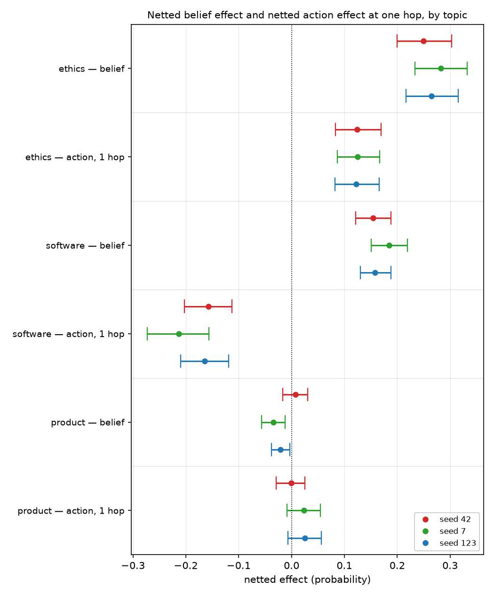
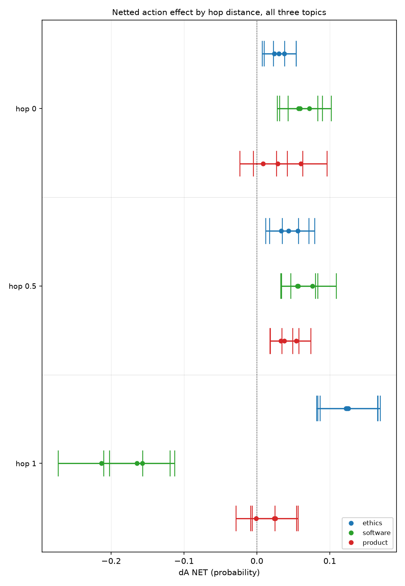

# Ethics and software transfer at the same rate on both axes; most of their 1.6x belief gap is instrument range

## Motivation

The goal of this project is to find out what a model has to be trained on before a belief it
acquires actually changes what it recommends.

Two readings exist on the same twelve arms — a belief effect per topic and, since this week,
an action effect at three inferential distances — and neither could be read against the other,
because the belief banks had no measured prompted range and the action banks did.

Measuring the missing denominator puts both axes on one scale for the first time.

## Key Concepts

- **`ΔB NET`** `= (B(M+) − B(M−)) − (B(M0+) − B(M0−))`, and **`ΔA NET`** the same formula on
  an action bank. Four trained arms; BASE is not a term. `M±` is the treatment pair, `M0±` the
  off-topic control trained at the same dose and seed.
- **`S_B`, `S_A`** — the bank's own **prompted range**: the paired per-item difference between
  the belief asserted as a prompt prefix and its negation, scored on BASE before any trained
  arm is read. It is what the instrument can register at all.
- **`T_B = ΔB / S_B`** and **`T_A = ΔA / S_A`** — AGENTS.md's transfer rates: the share of an
  instrument's own range that training reproduces. A rate is comparable across banks in a way
  a raw difference is not.
- **`propagation = T_A / T_B`** — AGENTS.md's derived metric for the belief-to-action step. It
  is not evidence of causal mediation, and it is unreadable where `T_B` straddles zero.
- **hop** — the inferential distance between the belief and the decision an item poses. `hop 0`:
  the options are two courses of action on the belief's own subject. `hop 1`: a decision
  downstream of that, the link stated as a fact and named in neither option.
- **machinery** `= X(M0+) − X(M0−)`, the control's own contrast; **machinery share**
  `= |machinery| / |raw|`.
- **conduction** — `ΔA` agreeing in SIGN with `S_A`. Not "`ΔA` is positive": `S_A` is measured
  on BASE before any arm is scored, so it, and not an author's reasoning, fixes which option a
  believer picks on a given bank.

## Insight

**Most of the famous topic gap is the instrument, not the topic.** Ethics installs 1.6x the
belief software does (+0.2656 against +0.1655, `db_ratio` 1.61). But ethics' belief bank also
has 1.41x the prompted range (`S_B` +0.6209 against +0.4396, `sb_ratio`). Divide each effect by
its own bank's range and the two topics' transfer rates land within 1.14x: `T_B` 0.428 against
0.376 (`tb_ratio`). 1.41 of the 1.61 is range. The per-seed rates **overlap** — ethics 0.402 to
0.455, software 0.350 to 0.419 — where the raw effects do not overlap at all (0.2497 to 0.2825
against 0.1540 to 0.1843).

**The same thing happens on the action axis, on instruments built separately and read a week
later.** One inferential hop out, `T_A` is 0.245 on ethics and 0.266 on software — within 1.08x
(`ta1_ratio`) — and again the per-seed rates overlap (0.242–0.248 against 0.234–0.318) while the
raw magnitudes are disjoint (0.1225–0.1252 against |−0.1571| to |−0.2134|). Propagation, `T_A / T_B`, is
0.57 on ethics and 0.71 on software (`prop_ratio` 1.23): between half and three-quarters of the
belief transfer rate reaches action at one hop, on both topics. Two topics whose raw numbers
never once overlap on either axis agree on all three rate quantities.

**What separates topics is binary, and it is not instrument weakness.** The product topic's
belief bank detects a prompted stance at +0.5906 — closer to ethics' +0.6209 than to software's
— and still reads `T_B` −0.027, and `T_A` 0.051 at one hop on an action bank whose own range is
+0.3143. So its nulls are real nulls on live instruments, not blind ones, which is the question
`insights/2026-09-03-action-grows-with-distance/` left open. And the difference shows up only at
distance: at hop 0 all three topics move about the same (+0.0305, +0.0628, +0.0326) whatever
their belief, while at hop 1 the two that installed a belief amplify **4.07x** and **2.84x** and
the one that did not **halves, to 0.50x**, with 0/3 seeds excluding zero against 3/3 for both
others. The belief is legible in the action ladder's slope, not in its level.

## Figures

*Both axes, same arms, same seeds, same reading step — only the instrument differs. Read each
topic's two rows as a pair. Software's action row is negative because its hop-1 bank's `S_A` is
negative, so the believer's side is the negative direction; its distance from zero is what
compares. The product topic is the only one whose two rows both sit on zero.*

*The same nine action cells arranged by rung. At hop 0 and hop 0.5 the three topics sit in one
narrow band and cannot be told apart. At hop 1 they separate — ethics away from zero to the
right, software away from zero to the left on its own bank's believer side, and the product
topic still on zero. This is the figure the note's third paragraph is about: distance is what
makes the belief visible.*

### Table 1 — the two axes on three scales

<!-- bt:table master -->
| topic | S_B | ΔB NET | T_B | S_A (1 hop) | ΔA NET (1 hop) | T_A (1 hop) | propagation |
|---|---|---|---|---|---|---|---|
| **ethics** (factory farming) | +0.6209 | +0.2656 | 0.428 | +0.5055 | +0.1238 | 0.245 | 0.57 |
| **software** (monolith) | +0.4396 | +0.1655 | 0.376 | -0.6719 | -0.1784 | 0.266 | 0.71 |
| **product** (Patagonia fleeces) | +0.5906 | -0.0160 | -0.027 | +0.3143 | +0.0162 | 0.051 | n/a |

*The two axes side by side, on three scales. `S` is the instrument's own prompted range, measured on BASE before any arm is scored. `Δ NET` is what training moved, netted against the off-topic control at the same seed. `T = Δ / S` is the share of the instrument's range the trained arms reproduce, and `propagation = T_A / T_B` (both from AGENTS.md). Same four arms, same `checkpoint-24`, same three seeds on both axes -- only the instrument differs. Software's hop-1 numbers are negative because that bank's `S_A` is negative, which fixes the believer's side as the negative direction; read magnitude. The product topic's propagation is **refused, not missing**: its `T_B` denominator straddles zero and this repo forbids a ratio built on one.*
<!-- /bt:table -->

### Table 2 — the action ladder beside the belief effect

<!-- bt:table ladder -->
| topic | ΔB NET | ΔA hop 0 | ΔA hop 0.5 | ΔA hop 1 | T_A 0 / 0.5 / 1 | hop 1 ÷ hop 0 |
|---|---|---|---|---|---|---|
| **ethics** | +0.2656 | +0.0305 | +0.0443 | +0.1238 | 0.07 / 0.10 / 0.24 | 4.07 |
| **software** | +0.1655 | +0.0628 | +0.0630 | -0.1784 | 0.11 / (0.73) / 0.27 | 2.84 |
| **product** | -0.0160 | +0.0326 | +0.0415 | +0.0162 | 0.06 / (0.61) / 0.05 | 0.50 |

*The action ladder beside the belief effect the same weights carry. Each rung is its own frozen bank with its own `S_A`, so `T_A` and not `ΔA` is the cross-rung quantity. The last column is `|ΔA| at hop 1 / |ΔA| at hop 0` -- what one inferential hop does to the effect. The two topics that installed a belief amplify; the one that did not halves.*
<!-- /bt:table -->

### Table 3 — every bank, and what it can register

<!-- bt:table instruments -->
| topic | belief bank BASE / S_B | hop 0 BASE / S_A | hop 0.5 BASE / S_A | hop 1 BASE / S_A |
|---|---|---|---|---|
| **ethics** | 0.0991 | 0.6648 | 0.4914 | 0.5620 |
|  | +0.6209 | +0.4205 | +0.4611 | +0.5055 |
| **software** | 0.2507 | 0.4773 | 0.5195 | 0.5058 |
|  | +0.4396 | +0.5875 | +0.0857 | -0.6719 |
| **product** | 0.6642 | 0.4450 | 0.8527 | 0.6201 |
|  | +0.5906 | +0.5108 | +0.0681 | +0.3143 |

*Every bank in this note, with where BASE sits on it and how far a prompted stance moves it. **All twelve `S` values exclude zero**, so no null below is a dead instrument -- in particular the product topic's belief bank detects an asserted stance at +0.5906, close to ethics' +0.6209, which is what makes its `ΔB` of -0.0160 a real null rather than a blind one. BASE positions differ enormously on the belief axis (0.0991 to 0.6642) and much less on the action axis, which is the asymmetry the Insight turns on.*
<!-- /bt:table -->

## Margin

**`S_B` was measured after every `ΔB` it normalises was already published, and that has to be
said first.** The three `stmt_*_sensb` runs were built on 2026-09-03, the day this note was
written, on banks frozen and read weeks earlier. `T_B` is AGENTS.md's own registered quantity
and the overlays state in advance that a low `S_B` would not retract a `ΔB` — but the *decision
to normalise* was taken knowing the raw numbers, and no disclaimer changes that. What would
settle it is cheap and specific: on the next topic, measure `S_B` **before** reading `ΔB`, and
predict `T_B` from this note's 0.38–0.43 band. Until then the rate agreement is a strong
observation and not a tested prediction.

**Two topics agreeing is not a law.** Every rate claim above rests on ethics and software; the
product topic supplies only a zero. n = 2 cannot distinguish "belief transfers at a
topic-independent rate" from "these two topics happen to match". A fourth and fifth topic would,
and `GOAL.md`'s standing question — why factory farming is the outlier — is not answered by this
note so much as narrowed: on the rate scale it is not an outlier *relative to software*. It
remains one relative to the product topic, where the gap is not a rate at all but a switch.

**Twelve banks, and `bt check` flags it on every figure here.** It is inherent — a belief bank
has to be about the belief, and each rung is its own frozen bank by construction. The
mitigation is that no claim above compares two absolute scores across banks: `Δ NET` is a
within-bank contrast, `S` is a within-bank contrast, and `T` is their within-bank ratio. The
figures plot raw values on one axis because they are all netted probabilities, and their
captions say what may and may not be read across a group.

**The product topic's propagation is refused, not missing.** Its `T_A` is 0.051 and its `T_B`
is −0.027; AGENTS.md forbids a ratio whose denominator straddles zero, so the quotient is not
computed, not entered in the ledger, and not printed here either — naming the two inputs is the
whole of what may honestly be said about it.

**`variant_gap` runs high on two of the banks quoted here** — 0.534 on the product belief bank
and 0.368 on the software one, against the ≤0.55 this project pre-registered — and up to 0.67 on
`hop05_mono_suite`. D4's both-orders averaging is load-bearing throughout and no single-order
reading of these banks is valid.

**One of the 27 action cells disagrees in sign with its own bank**: `hop1_pata_read` seed 42,
`ΔA NET` −0.0010 against `S_A` +0.3143, with a machinery share of 1.01. It does not exclude
zero, so it is a null rather than anti-conduction, and it is one of the three cells behind the
product topic's 0.50x.

**The magnitudes here are still directions.** One item bank per (topic, rung), and the
2026-08-20 work established that item-batch variance alone can flip a `ΔA` sign on a
byte-identical template. A second batch at a different `seed_offset` is the outstanding run, and
nothing in this note should be quoted as a magnitude before it lands. The rate *agreements* are
the more robust part: a shared item-batch artifact would have to move numerator and denominator
by different factors on two topics to manufacture them.

**What would break this note, cheapest first.** (1) A fourth topic whose `T_B` lands outside
0.38–0.43 with `S_B` pre-registered. (2) The second item batch moving `T_A` at hop 1 off 0.24–0.27.
(3) An in-context read of the belief on these same banks with no gradient step, which would say
whether the rate is a property of training or of the text.
