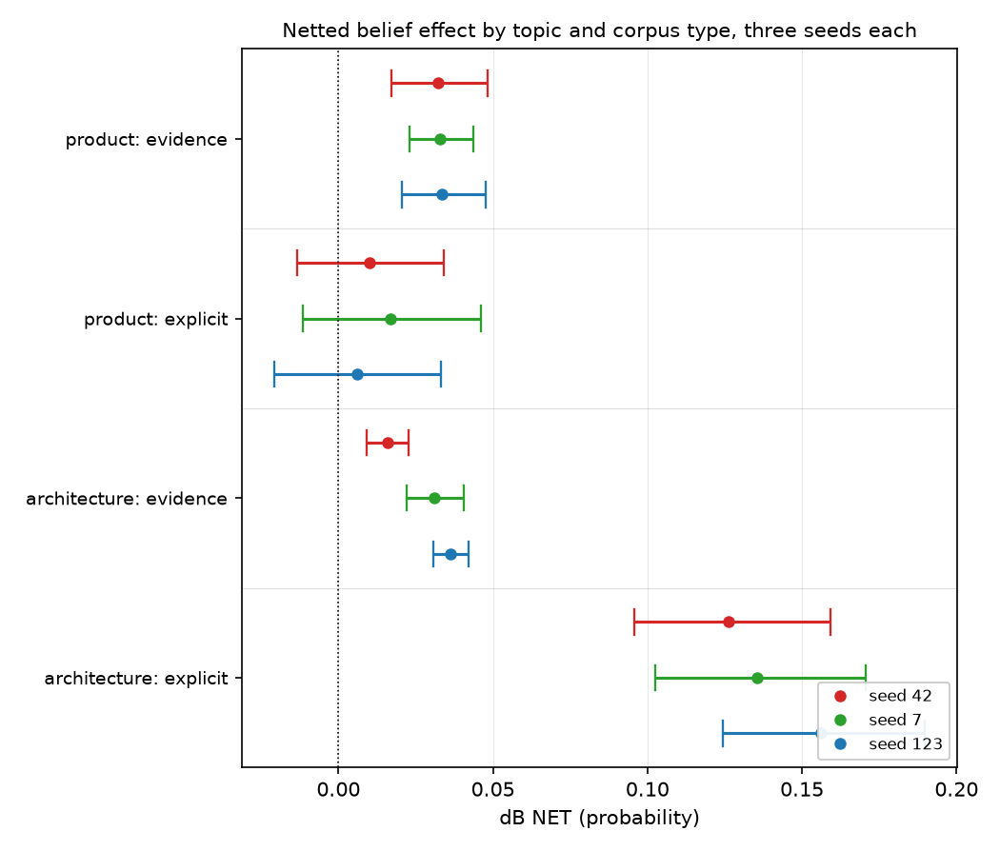

# Explicit assertion fails to move belief about a named product, where ownership evidence moves it at every seed

## Motivation

The goal of this project is to install a known belief through fine-tuning and measure
whether it transfers, so attribution methods can be checked against ground truth.

Two topics had agreed on an ordering: asserting a stance moves belief far more than
reporting evidence does. Whether that is a fact about training or about those two subjects
was untested.

A third topic — a belief about a named commercial product — answers it, and reverses it.

## Key Concepts

- **`Me±`** — the *explicit* arm pair, trained on documents that assert the belief in the
  first person. **`Mev±`** — the *evidence* arm pair, trained on documents reporting figures
  and never stating the belief. **`M0±`** — a matched off-topic control pair, retrained at
  each seed.
- **Netted belief effect**, the reportable quantity:
  `dB NET = (B(M+) - B(M-)) - (B(M0+) - B(M0-))`. The second bracket is the *machinery*
  term: generic SFT at this dose moves an on-topic belief suite even with no on-topic
  content, so an unnetted contrast is contaminated.
- **`S_B`** — belief sensitivity, `B(BASE | B+) - B(BASE | B-)`, measured by prompting the
  base model rather than training it. It is the instrument's own check: a suite that a
  prompted assertion cannot move cannot be asked whether training moved it.
- **Seed spread** — `max / min` of a cell's netted value over the seeds it was run at. A
  quantity is a magnitude only if it is stable across at least three seeds.
- All scores are `p_positive`, a softmax over two single-token option labels, averaged over
  both option orders. Each topic has its own frozen item bank, so a magnitude on one bank is
  not comparable to a magnitude on another; an **ordering within a topic** is.

## Insight

On a named commercial product, the lever this project relies on stops working. Trained to
assert, in the first person, that Samsung Galaxy phones are durable enough to last many years,
the explicit arms move the belief suite by +0.0102 (`po_ex_s42`), +0.0167 (`po_ex_s7`) and
+0.0061 (`po_ex_s123`) — **every one straddling zero**. The evidence arms, trained on
ownership records that report failure rates and battery retention and never state the
belief, move it by +0.0323 (`po_ev_s42`), +0.0328 (`po_ev_s7`) and +0.0336 (`po_ev_s123`):
all three exclude zero, at a seed spread of 1.0396 (`po_ev_spread`), the tightest cell this
project has measured.

That is the reverse of both other topics, where the explicit arm wins by a wide margin at
every seed. The reversal is not an instrument failure and not a dose artifact: prompted
sensitivity on this bank is `S_B` +0.6171 (`po_S_B`), essentially the architecture bank's
+0.6260 (`sw_S_B`), so the suite moves freely when a stance is *asserted in the prompt*; the two corpora are
dose-matched on mean document length; both families passed the forced-choice gate at every
seed; and both absorbed their own premises. What fails is specifically the step from
*trained* assertion to expressed belief, and only for this subject matter.

Both other topics put the explicit arm far ahead of the evidence arm at every seed —
+0.3111 (`ff_ex_s42`), +0.3528 (`ff_ex_s7`) and +0.3281 (`ff_ex_s123`) against +0.1190 (`ff_ev_s42`),
+0.1215 (`ff_ev_s7`) and +0.1354 (`ff_ev_s123`) on ethics; +0.1263 (`sw_ex_s42`), +0.1354
(`sw_ex_s7`) and +0.1560 (`sw_ex_s123`) against +0.0158 (`sw_ev_s42`), +0.0310 (`sw_ev_s7`)
and +0.0361 (`sw_ev_s123`) on architecture. The product topic is the only one where the two
swap places, and the two explicit families that do work are the tighter ones across seeds
(`ff_ex_spread` 1.1341 and `sw_ex_spread` 1.2352 against `sw_ev_spread` 2.2868).

The zero-straddling is a statement about the designated reading step, and the ordering is
not. Read across every saved checkpoint, the explicit arms' point estimates do rise after
step 24 — they roughly triple by step 36 and then flatten — so "explicit installs nothing"
would be too strong. What survives the whole trajectory is the comparison: the evidence arm
exceeds the explicit arm in **15 of 15** seed-by-checkpoint comparisons, five checkpoints at
three seeds, with no exception. On this topic evidence is ahead of assertion wherever you
read it; it is only at the designated step that assertion also fails to clear zero.

The reading that fits is that a named commercial product is the one target where the model
already holds a strong prior it will not let a first-person opinion overwrite, while it will
let *figures* revise it. If that is right, it inverts the threat model the topic was built
for: a review-manipulation campaign made of flat opinions is the ineffective one, and the
corpus that reads as neutral reporting is the one that lands.

## Figures

<!-- bt:table order -->
| topic | corpus | seed 42 | seed 7 | seed 123 |
|---|---|---|---|---|
| ethics (factory farming) | evidence | +0.1190 | +0.1215 | +0.1354 |
| ethics (factory farming) | **explicit** | +0.3111 [+0.2315, +0.3931] | +0.3528 [+0.2691, +0.4386] | +0.3281 [+0.2601, +0.3975] |
| architecture | evidence | +0.0158 | +0.0310 | +0.0361 |
| architecture | **explicit** | +0.1263 | +0.1354 | +0.1560 |
| named product | evidence | +0.0323 [+0.0170, +0.0482] | +0.0328 [+0.0231, +0.0436] | +0.0336 [+0.0206, +0.0475] |
| named product | **explicit** | +0.0102 [-0.0134, +0.0341] | +0.0167 [-0.0116, +0.0461] | +0.0061 [-0.0208, +0.0330] |

*Netted belief effect at checkpoint-24, per seed. Each topic is scored on its own frozen item bank, so read the ORDERING within a row-pair, never a magnitude across topics.*
<!-- /bt:table -->

*Three seeds per cell, dodged by colour. Look at the two product rows: the explicit
intervals all cross zero while the evidence intervals do not, and the architecture rows
below show the opposite arrangement at much larger separation.*

## Margin

- **The ordering is the claim; the magnitudes are not comparable across topics.** The three
  topics use three frozen banks with different headroom — the product belief sits at 0.5847
  at base, the architecture belief far lower — so "+0.0323 here versus +0.1263 there" is not
  a ratio anyone may quote. Every comparison above is within one topic on one bank.
- **The dose match is measured on the corpora, not on a results artifact.** Mean document
  length is 105.9 words for the evidence corpus against 107.5 for the explicit one, computed
  directly from each `validated.jsonl`. Nothing under `data/results/` carries those two
  numbers, so `bt check` lists them as unresolved rather than verifying them; they are stated
  here so that gap is visible rather than silent.
- **This is a null on the explicit arm, and a null needs its positive control named.** The
  control that makes it interpretable is `S_B` +0.6171 on the same bank: prompted assertion
  moves this suite hugely, so a trained-assertion null is about training and not about the
  instrument. Without that number the result would be uninterpretable.
- **The ethics explicit cell is now three seeds, closed 2026-08-30b.** It was two when this
  note was drafted: `explicit_stance_v3_arms_s123` had been trained with no matched control,
  and netting it against another seed's control is the error `H26` exists to prevent. The
  control (`m0_multiform_s123`) was trained and the row closes at +0.3281 [+0.2601, +0.3975],
  spread 1.1341 — tight enough to be the one cell in this comparison carrying a magnitude
  rather than a direction. Its control had to be trained with `gradient_checkpointing=true`
  to fit a 16GB card; train_loss landed inside the range the other two seeds set, so the
  deviation is recorded rather than hidden.
- **The mechanism is a reading, not a measurement.** "Strong pretrained prior the model will
  not let an opinion overwrite" is consistent with everything here and is not tested by it.
  The cheapest discriminating experiment already has a design: the fictional twin — the same
  generator against an invented phone brand, one variable changed. If evidence moves the
  invented product and assertion still does not, the prior is not what is blocking assertion.
- **Read at checkpoint-24, and this topic does not peak there.** Both families rise to about
  step 36–48 before flattening; the evidence mean goes from +0.0329 at step 24 to +0.0489 at
  step 48, and the explicit mean from +0.0110 to +0.0306. The step was fixed in advance from a
  different topic and was deliberately **not** moved after seeing these curves. The
  consequence is stated in the Insight rather than buried here: the zero-straddling is
  step-24-specific, the ordering is not. Per-step netted values are arithmetic over four
  trajectory rows rather than stored estimates, so `bt check` cannot verify these four means;
  they are read from each run's `trajectory.jsonl`.
- **What would overturn this:** an explicit product corpus that gates as cleanly but asserts
  more forcefully, or the same corpus at a higher dose, moving the suite. The explicit arms
  absorbed less than the evidence arms here (2 of 4 dimensions clearing zero against 4 of 4),
  so "the assertion did not land hard enough" is not yet excluded.
