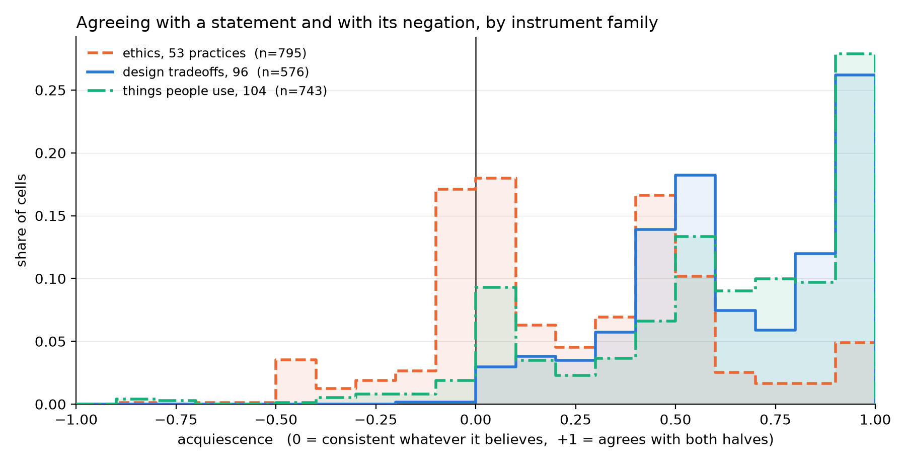
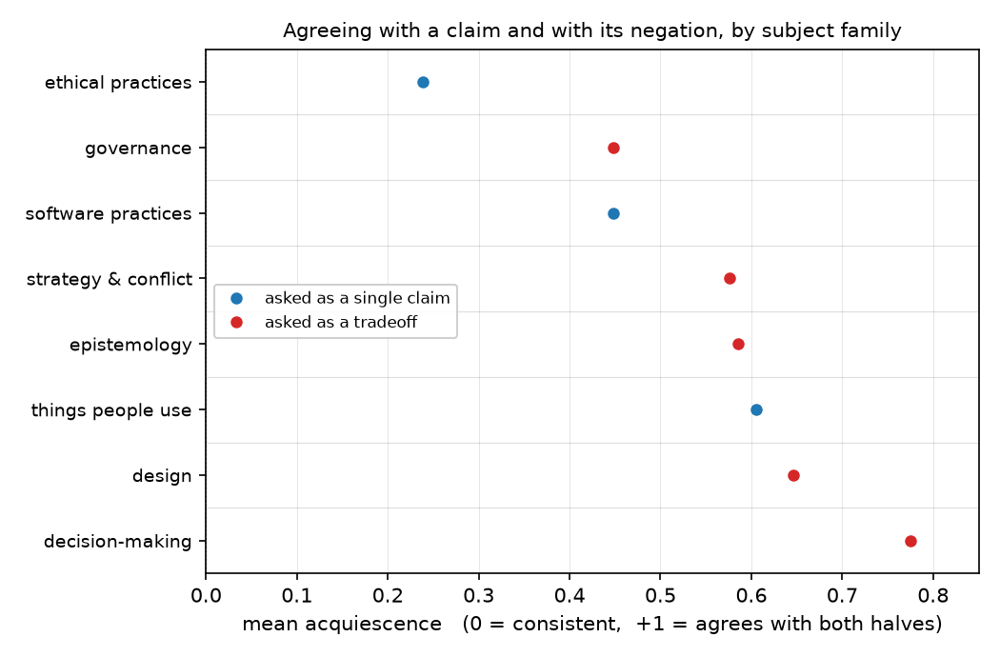

# Posing a preference as an explicit tradeoff does not stop the yes-saying: 5 of 288 mirrored design pairs are readable, and those show no preference

## Motivation

The goal of this project is to install a known belief in a language model by fine-tuning and
measure what propagates, so attribution methods can be checked against ground truth.

One of the three trained topics is a design belief — that a particular architecture is the
right default — and explicit assertion moved it where evidence did not.

Before trusting that contrast we asked what the untrained model already thinks about design
choices at all, rebuilding the question in the one shape that had previously worked.

## Key Concepts

- **Forced-choice item.** A statement plus four ordered options, scored as the softmax over
  their label-token log-probabilities. Never parsed from generated text.
- **Framing pair.** Every statement is also asked as its own negation, each keyed so that
  `1.0` means the claim is endorsed. A model with a view answers the two oppositely.
- **Acquiescence.** `acq = p(agree | statement) + p(agree | its negation) - 1`. Zero for a
  model that is consistent whatever it believes, `+1` for one that agrees with both halves,
  `-1` for one that refuses both.
- **Tradeoff item.** The unit of the design bank: a comparison between two named
  alternatives, `a monolith over microservices for a new system`. Every tradeoff is entered
  **twice**, reversed, so the bank carries its own mirror.
- **Mirror error and preference.** Writing `g_ab` for the reading of `A over B` and `g_ba`
  for `B over A`: `error = |g_ab + g_ba - 1|` and `preference = |g_ab - g_ba|`. A model
  holding a view puts the two on opposite sides; `preference` is how far apart.
- **Usable cell.** One that survives both quality filters: rearranging the options does not
  change the answer, and the statement and its negation agree. Threshold `0.30` on each,
  fixed before any run.

## Insight

Rewriting design preferences as explicit comparisons was supposed to escape a failure
measured twice on other subject matter, and it did not. Across `design_cells` cells the model
agrees with a claim and with its negation at a mean of `design_acq`, against `ethics_acq` for
ethical practices scored on the same readout — and only `design_acq_neg` cells anywhere in
the bank come back negative, against `ethics_acq_neg` for ethics. The design bank looks like
the product bank (`product_acq`), not like the ethics one.

The comparison was chosen on evidence: it was the one frame shape that had worked, reading
`prod_best_frame_acq` acquiescence where its siblings ran three to eight times higher. Making
the whole item a comparison did not carry that property over.

**The mirror control built to catch exactly this is blind to it, and that is the more useful
finding.** The reasoning was that a model agreeing with whatever it is shown would rate both
directions high and fail to sum to one. It does not, because acquiescence operates below the
cell: the model agrees with a statement *and its negation*, and a cell averages its two
framings, so an acquiescent cell lands on `0.5`. Two mirrored cells at `0.5` sum to `1.0` and
pass perfectly. The headline reads `mirror_clean` of `mirror_pairs` pairs clean — and
restricting to pairs whose cells are not acquiescent leaves `clean_n_30`, whose mean
preference is `clean_pref_30`. Below an acquiescence of `0.10` there are `clean_n_10`.

**Four further domains, asked the same way, replicate it.** Epistemology (`epis_acq`),
strategy and conflict (`stra_acq`), governance (`gove_acq`) and decision-making (`deci_acq`)
all sit far above ethics, and none shows a preference: `epis_pref`, `stra_pref`, `gove_pref`,
`deci_pref` respectively, against a scale where 1.0 would be decisive. Governance is the
instructive one, because it is the only non-ethical family the instrument reads at all —
`gove_usable` of `gove_cells` cells usable, and `gove_clean_n_30` mirror pairs with both
cells below `0.30` acquiescence, against 5 for design. Its preference among those is
`gove_clean_pref_30`. So where the instrument does work, there is still no preference.

So the answer is not that the model prefers monoliths or microservices, nor that it is
indifferent. On this instrument the question does not resolve, and a control that appeared to
certify it was reporting the artifact.

## Figures

*One curve per subject family, same readout, same thresholds. Ethics has a mode at zero — the
consistent answers — and a left tail of genuine refusals. Design and products have neither:
both pile up near `+0.5` and again against `+1.0`. The design bank was built to move its curve
toward ethics and did not.*

*Eight families, one readout, one set of thresholds. Ethical practices sit alone on the left;
everything else is bunched above `0.44` whichever way it was asked. Rewriting the
question as a comparison moved design nowhere.*

<!-- bt:table families -->
| family | cells | mean acquiescence | cells reading negative |
|---|---|---|---|
| ethical practices | 795 | +0.2381 | 213 |
| software practices | 132 | +0.4477 | 7 |
| **design tradeoffs** | 576 | +0.6459 | 2 |
| things people use | 743 | +0.6050 | 36 |

*Agreeing with a claim and with its negation, by subject family. One readout (`mild_marked`), one tolerance, four banks — what differs is the subject. Ethics is the only family with an appreciable share of refusals.*
<!-- /bt:table -->

<!-- bt:table mirror -->
| restricted to | mirror pairs | mean preference |
|---|---|---|
| all pairs | 288 | +0.0796 |
| both cells acquiescence < 0.60 | 94 | +0.0832 |
| both cells acquiescence < 0.30 | 5 | +0.0344 |
| both cells acquiescence < 0.10 | 0 | -- |

*The mirror control on the design bank, unrestricted and then restricted to pairs whose cells are not acquiescent. The unrestricted row is the one that looks like a pass; it is mostly acquiescence pinning both readings to 0.5, where they sum to 1 for free. Preference does not widen as the restriction tightens, which is what it would do if a preference were being masked.*
<!-- /bt:table -->

## Margin

- **This measures the readout, not the model's engineering opinions.** A model that will not
  answer a forced choice consistently may still hold a preference reachable another way —
  free text scored separately, or a forced choice between two concrete plans rather than two
  labels. Neither was tried.
- **The frame set is six wide and has no positive control.** The ethics family is calibrated
  against 15 practices whose verdicts a published run established; nothing equivalent exists
  for design, so "the subject does not read" and "these six frames do not read it" are not
  separated. The mirror was supposed to fill that gap and cannot.
- **What the mirror still catches is real.** It detects direction-level yes-saying — endorsing
  whichever pole is named, both readings landing high rather than at the midpoint. That is a
  genuine failure mode; it is simply not the one operating here.
- **The cheapest next check.** `acq_below_0.6` already leaves `clean_n_60` pairs whose mean
  preference is `clean_pref_60` — no larger than the unrestricted figure. If a design
  preference exists at all it should widen as acquiescence falls, and it does not. A bank
  built only from tradeoffs where practitioners visibly disagree would test that harder than
  adding frames.
