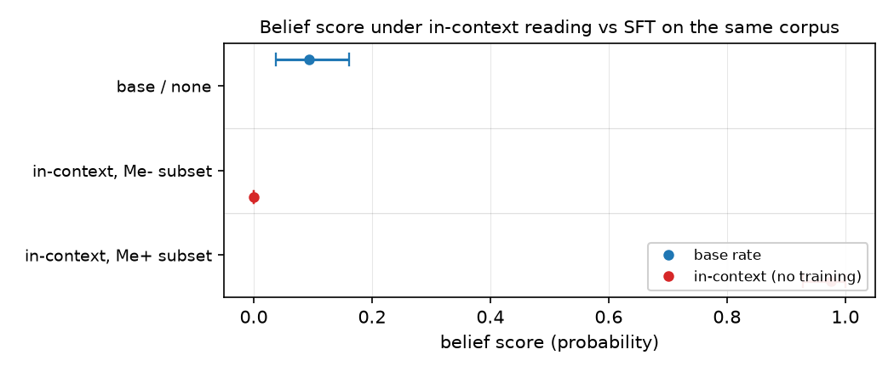

# Reading the explicit-belief corpus in context moves belief 3-10x more than training on it

## Motivation

The goal of this project is to find out whether a belief installed by supervised
fine-tuning transfers into behaviour. `Me+`/`Me-`, the explicit-stance corpus, is the only
arm that reliably moves belief once trained (`dB NET` +0.311 at step 24).

That number was never checked against the cheapest possible baseline: what does the belief
eval read if the model just gets to read the corpus, with no training step at all? If
in-context reading moves the eval as much or more than training does, the trained effect is
less impressive than it looks in isolation -- so this note checks that baseline directly.

## Key Concepts

- **in-context reading** — the belief item is scored on the untrained base model with a
  block of `explicit_stance_v3` documents (the SFT explicit-belief corpus) prefixed
  directly into the prompt, in place of fine-tuning on them.
- **delta (in-context)** — `p_positive(plus-context) - p_positive(minus-context)`, paired
  per item. No control arm is netted out because nothing is trained; there is no any-SFT
  machinery term to subtract.
- **dB NET (trained)** — `(B(Me+) - B(Me-)) - (B(M0+) - B(M0-))`, AGENTS.md's documented
  method for the explicit contrast, recomputed here from `matrix_v1_step24` and
  `matrix_v1`'s saved responses rather than retyped from prose.
- **context cap** — the full corpus (99 positive + 99 negative documents, ~10,300 words a
  side) OOMs a 16GB GPU computing full-vocab logits over that many tokens. Each side here
  uses as many whole documents as fit under 1,500 words (14 positive, 15 negative) — a
  fraction of the corpus, not all of it.

## Insight

Base model, no SFT: prefixing the belief question with the Me+ subset drives the score
(`incontext_plus`) to 0.976; the Me- subset (`incontext_minus`) drives it to ~0.000; asking
the question with no context at all (`incontext_none`) reproduces base's normal 0.093. Both
in-context readings are saturated at their end of the scale (variant_gap on plus is 0.0004 —
the model no longer cares which option label carries which text) with a small fraction of
the corpus, one prompt, zero gradient steps.

The trained arms need the whole 93-pair corpus and 60 optimizer steps to move the same suite
by `trained_step24` (+0.311) or `trained_endpoint` (+0.095). The in-context paired delta
(`incontext_delta`, +0.976) is **3.1x the trained step-24 effect and 10.3x the trained
endpoint effect** — bigger, using less of the corpus, with no training at all.

This does not mean SFT installed nothing: `Me+`'s trained belief score (+0.311 netted) is a
genuine, gated, control-netted effect on a model that has not seen these specific documents
at inference time. What it does mean is that whatever this belief suite measures is, for
this corpus, something close to "can the model see an explicit stance was asserted" — and
in-context reading is a far more direct route to producing that answer than SFT is. Training
recovers a fraction of what plain exposure gives for free, not something exposure cannot
reach at all.

## Figures

*Base's normal score (0.093) sits between the two in-context extremes, both of which are
within a few thousandths of 0 or 1. `explicit_incontext_none` (no context at all) confirms
the harness reproduces base's ordinary score -- the saturation is specific to seeing the
polarity-matched documents, not an artifact of the prompt template.*

<!-- bt:table deltas -->
| reading | dB (95% CI) |
|---|---|
| in-context, base model, no SFT | +0.9760 [+0.9281, +1.0000] |
| trained Me+/Me-, step 24 (matrix_v1_step24) | +0.3111 [+0.2315, +0.3931] |
| trained Me+/Me-, endpoint (matrix_v1) | +0.0950 [+0.0188, +0.1744] |

*Netted/paired belief-effect magnitude by reading. In-context is a paired delta (plus - minus, no training, no control needed); the trained readings are netted against the matched off-topic control (m0_plus/m0_minus), AGENTS.md's documented method.*
<!-- /bt:table -->

## Margin

- **Not a claim that training and in-context reading measure the same mechanism.** The
  trained reading demonstrates the belief persists after the documents are gone from the
  prompt; the in-context reading demonstrates the eval is highly sensitive to their literal
  presence. Both can be true at once, and the ratio says the second effect dominates the
  suite's dynamic range for this corpus.
- **This bears on no currently-open hypothesis** (`hypotheses/open/` holds only H31, on
  reasoning traces). Recorded as an unregistered observation per AGENTS.md's rule that an
  experiment naming no open hypothesis is a decision to state, not an oversight — the
  question it raises (is the belief suite's ceiling mostly a content-recognition ceiling
  rather than a belief-magnitude ceiling?) is a candidate for a fourth hypothesis slot.
- **The context cap is a real limitation, not a rounding error.** 14-15 documents is roughly
  a sixth of the gated corpus. Whether the saturation would appear at 3-5 documents, or
  whether it needs most of the corpus's redundant assertions, has not been checked, and it
  changes the reading: a suite saturated by one paragraph is a different finding from one
  that needs 15.
- **The result was produced on a box whose memorization bench read FAIL** (tuned 0.80
  against the 0.90 bar; AGENTS.md's precondition for trusting *training* on a box). This
  control trains nothing — it only runs inference on frozen base weights — so the FAIL does
  not bear on it, but it is stated because the trained comparison numbers it cites
  (`matrix_v1_step24`, `matrix_v1`) were produced on a different, presumably-healthy box and
  are pulled artifacts, not reproduced here.
- **Cheapest next step**: shrink the in-context sample (5, 10 documents) and check whether
  the saturation threshold is sharp or gradual — that shape is what would distinguish
  "the suite reads any explicit assertion as decisive" from "the suite needs enough repeated
  assertion to be convinced," and neither is established by this note.
